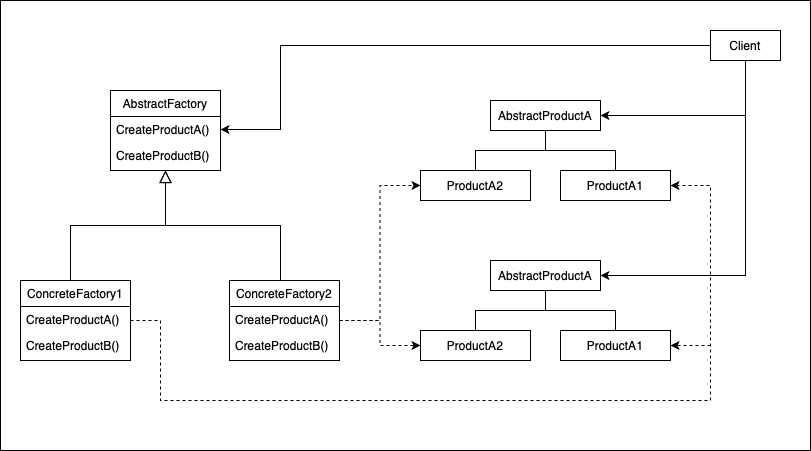

# 抽象工厂(Abstract Factory)

## 意图

提供一个接口以创建一系列相关或相互依赖的对象，而无需指定它们具体的类。

## 适用性

- 一个系统要独立于它的产品的创建，组合和表示。
- 一个系统要由多个产品系列中的一个来配置。
- 要强调一系列相关的产品对象的设计以便进行联合使用。
- 提供一个产品类库，但只想显示它们的接口而不是实现。

## 结构

## 参与者

- AbstractFactory
  - 声明一个创建抽象产品对象的操作接口。
- ConcreteFactory
  - 实现创建具体产品对象的操作。
- AbstractProduct
  - 为一类产品对象声明一个接口。
- ConcreteProduct
  - 定义一个将被相应的具体工厂创建的产品对象。
  - 实现AbstractProduct接口。
- Client
  - 仅使用AbstractFactory和AbstractProduct类声明的接口。

## 协作

## 效果

## 实现
