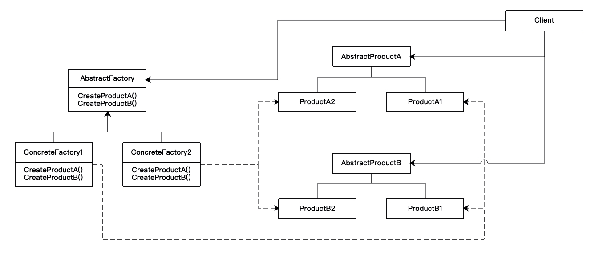

# 抽象工厂(Abstract Factory)

## 意图

提供一个接口以创建一系列相关或相互依赖的对象，而无需指定它们具体的类。

## 适用性

- 一个系统要独立于它的产品的创建，组合和表示。
- 一个系统要由多个产品系列中的一个来配置。
- 要强调一系列相关的产品对象的设计以便进行联合使用。
- 提供一个产品类库，但只想显示它们的接口而不是实现。

## 结构

## 参与者

- AbstractFactory
  - 声明一个创建抽象产品对象的操作接口。
- ConcreteFactory
  - 实现创建具体产品对象的操作。
- AbstractProduct
  - 为一类产品对象声明一个接口。
- ConcreteProduct
  - 定义一个将被相应的具体工厂创建的产品对象。
  - 实现AbstractProduct接口。
- Client
  - 仅使用AbstractFactory和AbstractProduct类声明的接口。

## 协作

- 在运行时创建一个ContreteFactory类的实例，该具体工厂能够创建具有特定实现的产品。创建不同的产品对象时应使用不同的具体工厂。
- AbstractFactory将产品对象的创建延迟到它的ConcreteFactory子类。

## 效果

- 优点
  - 分离了具体的类。
  - 使得易于交换产品系列，只需要改变具体的工厂即可使用不同的产品配置。
  - 有利于产品的一致性，当一个系列中的产品对象被设计成一起工作时，一个应用只能使用同一个系列中的对象。
- 缺点
  - 难以支持新种类的产品。扩展AbstractFactory需要涉及到其所有子类的改变。

## 实现

1. 将工厂作为单件。一个应用中一般每个产品系列只需要一个ConcreteFactory实例。
2. 创建产品。通常的办法是为每一个产品定义一个工厂方法，一个具体的工厂将为每个产品重定义该工厂方法以指定产品。
3. 定义可扩展的工厂。AbstractFactory通常为每一种它可以生产的产品定义一个操作。

## 代码示例

- [MazeFactory](./src/MazeFactory.h) -- AbstractFactory
- [IceMazeFactory](./src/IceMazeFactory.h) -- ConcreteFactory1
- [FireMazeFactory](./src/FireMazeFactory.h) -- ConcreteFactory2
- [Room](./src/Room.h) -- AbstractProductA
- [IceRoom](./src/IceRoom.h) -- ProductA1
- [FireRoom](./src/FireRoom.h) -- ProductA2
- [Door](./src/Door.h) -- AbstractProductB
- [IceDoor](./src/IceDoor.h) -- ProductB1
- [FireDoor](./src/FireDoor.h) -- ProductB2
- [Wall](./src/Wall.h) -- AbstractProductC
