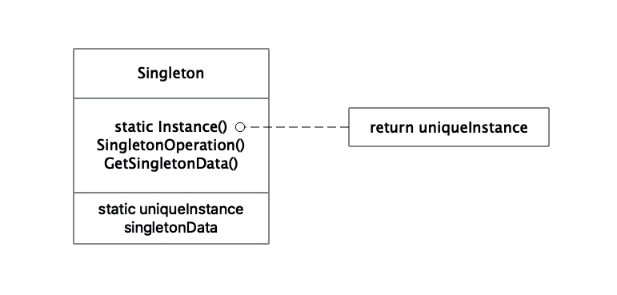

# 单例模式(Singleton)

## 意图

保证一个类仅有一个实例，并提供一个访问它的全局访问点

## 适用性

- 当类只能有一个实例且客户可以从一个众所周知的访问点访问它时。
- 当这个唯一的实例应该是通过子类化可扩展的，并且客户应该无需更改代码就能使用一个扩展的实例时。

## 结构

## 参与者

- Singleton
  - 定义一个Instance操作，允许客户访问它的唯一实例。Instance是一个类操作。
  - 可能负责创建自己的唯一实例

## 协作

- 客户只能通过Singleton的Instance操作访问一个Singleton实例

## 效果

- 优点
  - 对唯一实例的受控访问。
  - 缩小名字空间。Singleton模式是对全局变量的一种改进，避免那些存储唯一实例的全局变量污染名字空间
  - 允许对操作和表示的精化。Singleton可以有子类，而且用这个扩展类的实例配置一个应用是容易的。
  - 允许可变数目的实例。这个模式可以允许Singleton有多个实例，并用相同的方法来控制使用的实例数目。只有允许访问Singleton实例的操作需要进行改变。
  - 比类操作更灵活。C++中另一种封装单例的方法是使用静态成员函数，但难以通过改变设计来允许一个类有多个实例。静态成员函数不能够为虚函数，因此子类不能多态重定义它们。

## 使用Singleton所需要考虑的实现问题

1. 保证一个唯一的实例。使用静态成员函数的方式进行实现。
   如果将单例声明为全局或是静态的对象会有以下3个缺陷：
   - 无法保证静态对象只有一个实例会被声明。
   - 没有足够的信息在静态初始化时实例化每一个单例。
   - C++没有定义转换但愿上全局对象的构造器调用顺序，这意味着单例之间不能存在依赖关系。
2. 创建Singleton类的子类。
   - 使用单例注册表，在字符串名字于单例之间建立映射，当Instance需要一个单例时，根据名字请求单例。

## 代码示例

- 普通懒汉式单例（包含单例子类，线程不安全）
  - [MazeFactory.h](./src/Singleton_lazy_subclass/MazeFactory.h)
  - [MazeFactory.cpp](./src/Singleton_lazy_subclass/MazeFactory.cpp)
- 加锁懒汉式单例（线程安全）
  - [MazeFactory.h](./src/Singleton_lazy_lock/MazeFactory.h)
  - [MazeFactory.cpp](./src/Singleton_lazy_lock/MazeFactory.cpp)
- 内部静态变量懒汉式单例（C++11线程安全）
  - [MazeFactory.h](./src/Singleton_lazy_static/MazeFactory.h)
  - [MazeFactory.cpp](./src/Singleton_lazy_static/MazeFactory.cpp)
- 饿汉式单例（线程安全）
  - [MazeFactory.h](./src/Singleton_hungry/MazeFactory.h)
  - [MazeFactory.cpp](./src/Singleton_hungry/MazeFactory.cpp)
