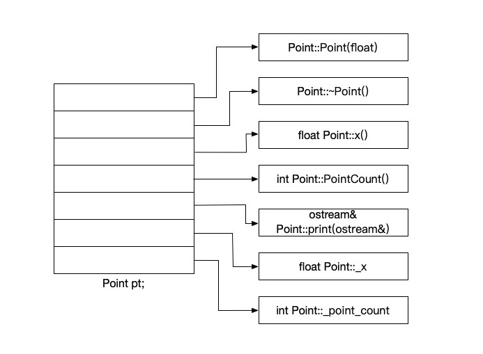

# C++对象模式

在C++中，有两种类数据成员(class data members): `static`和`nonstatic`，以及三种类成员函数(class member functions): `static`、`nonstatic`和`virtual`。  
已知如下类声明:

```cpp
class Point {
    public:
        Point(float xval);
        virtual ~Point();

        float x() const;
        static int PointCount();
    protected:
        virtual ostream& print(ostream& os) const;
        float _x;
        static int _point_count;
};
```

这个类模型在C++中的发展经过了以下三个阶段。

## 简单对象模型

第一个模型是为了尽量减低C++编译器中的设计复杂度而开发出来，赔上的是空间和执行期效率。  
在这个简单模型中，一个`object`是一系列`slots`，每一个`slot`指向一个`members`。`Members`按声明顺序，各被指定一个`slot`。每一个`data member`或`function`都有一个自己的`slot`。



在这个简单模型下，只存放指向成员的指针，因此可以避免成员拥有不同类型，从而需要分配不同的存储空间导致的问题。尽管这个模型最终没能应用于实际产品，不过关于索引或slot个数的概念，被应用在了C++指向成员的指针(pointer-to-member)的概念之中。

## 表格驱动对象模型

## C++对象模型
