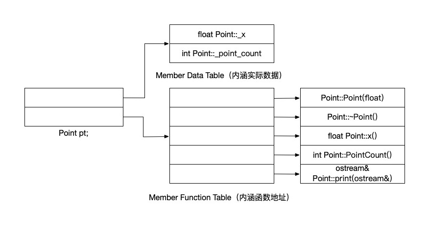
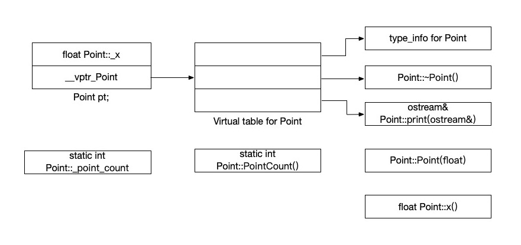

# C++对象模式

在C++中，有两种类数据成员(class data members): `static`和`nonstatic`，以及三种类成员函数(class member functions): `static`、`nonstatic`和`virtual`。  
已知如下类声明:

```cpp
class Point {
    public:
        Point(float xval);
        virtual ~Point();

        float x() const;
        static int PointCount();
    protected:
        virtual ostream& print(ostream& os) const;
        float _x;
        static int _point_count;
};
```

这个类模型在C++中的发展经过了以下三个阶段。

## 简单对象模型

第一个模型是为了尽量减低C++编译器中的设计复杂度而开发出来，赔上的是空间和执行期效率。  
在这个简单模型中，一个`object`是一系列`slots`，每一个`slot`指向一个`members`。`Members`按声明顺序，各被指定一个`slot`。每一个`data member`或`function`都有一个自己的`slot`。


在这个简单模型下，只存放指向成员的指针，因此可以避免成员拥有不同类型，从而需要分配不同的存储空间导致的问题。尽管这个模型最终没能应用于实际产品，不过关于索引或slot个数的概念，被应用在了C++指向成员的指针(pointer-to-member)的概念之中。

## 表格驱动对象模型

为了对所有的`classes`的所有的`objects`都有一致的表达方式，这种对象模型是把所有的members相关的信息抽出来，放在一个`data member table`和一个`member function table`中，`class object`本身只包含指向这两个表格的指针。每一个`member function table`都是一系列`slots`，每一个`slot`指出一个`member function`，`data member table`则直接持有`data`本身。



这个模型也没有成功应用于C++编译器，但是为虚函数的实现提供了一个有效方案。

## C++对象模型

此模型中，`nonstatic data members`被配置与每一个`class object`内，`static data members`则被存放在个别的`class object`之外，`static`和`nonstatic function members`也被放在个别`class object`之外。`Virtual function`则以下面两个步骤支持：

1. 每一个`class`产生出一堆指向`virtual function`的指针，放在表格中，表格被称为`virtual table（vtbl）`。
2. 每一个`class object`被安插一个指针，指向相关的`virtual table`。这个指针被称为`vptr`。指针的设定和重制由每个`class`的构造函数，析构函数，拷贝构造函数来自行完成。每一个`class`所关联的`type_info objec`t经由`vtbl`被指出来，存放在表格的第一个`slot`。



该模型的有点主要在于空间和存取时间效率，缺点在于一旦class object中的非静态数据成员有所改变，程序必须进行重新编译。
