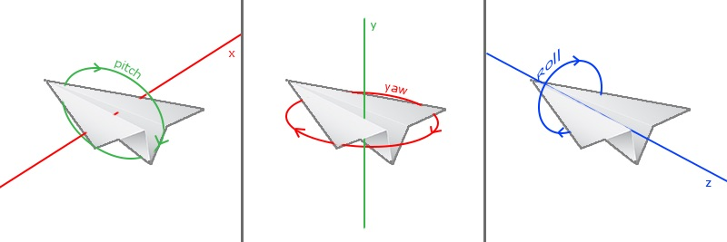

# 摄像机

## LookAt矩阵

LookAt矩阵会创建一个看向给定目标的矩阵。创建一个Look At矩阵需要使用3个互相垂直的轴和一个平移向量。创建LookAt矩阵所需要的矩阵运算如下：

$$ LookAt = \left[ \begin{matrix}
    R_x & R_y & R_z & 0 \\
    U_x & U_y & U_z & 0 \\
    D_x & D_y & D_z & 0 \\
    0 & 0 & 0 & 1
\end{matrix} \right] * \left[ \begin{matrix}
    1 & 0 & 0 & -P_x \\
    0 & 1 & 0 & -P_y \\
    0 & 0 & 1 & -P_z \\
    0 & 0 & 0 & 1
\end{matrix} \right] $$

其中`R`是右向量，`U`是上向量，`D`是方向向量，`P`是摄像机位置向量。

`GLM`中可以使用`glm::lookAt`来创建LookAt矩阵。

```cpp
//cameraPos代表摄像机位置
//centerPos代表目标位置
//cameraUp代表摄像机的上向量
glm::lookAt(cameraPos, centerPos, cameraUp);
```

## 欧拉角

欧拉角是可以表示3D空间中任何旋转的3个值，由莱昂哈德·欧拉在18世纪提出。一共有3种欧拉角：俯仰角(Pitch)、偏航角(Yaw)和滚转角(Roll)。

俯仰角是描述我们如何往上或往下看的角，偏航角表示我们往左和往右看的程度。滚转角代表我们如何翻滚摄像机。



通过以下计算可以改变摄像机的欧拉角，从而实现摄像机的不同朝向。

```cpp
//direction代表摄像机的前轴(Front)，前轴指向摄像机前方。
direction.x = cos(glm::radians(pitch)) * cos(glm::radians(yaw));
direction.y = sin(glm::radians(pitch));
direction.z = cos(glm::radians(pitch)) * sin(glm::radians(yaw));
```

得到欧拉角之后，可以通过以下计算来获得摄像机的上向量，从而获得重新计算的LookAt矩阵来重新获得摄像机的视野。

```cpp
//Front代表归一化之后的前向量，也就是由欧拉角计算出的摄像机的前轴
//Right表示摄像机的右向量
//Up表示摄像机的上向量
Front = normalize(direction);
Right = normalize(cross(Front, WorldUp));
Up = normalize(cross(Right, Front));
```

## 缩放

摄像机的缩放决定了摄像机所能看到的视野大小。视野定义了我们可以看到场景中多大的范围。当视野变小时，场景投影出来的空间就会减小。视野大小由`glm::perspective`的第一个参数来进行控制。
