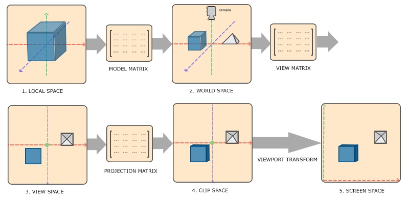

# 坐标系统

## 概述

在OpenGL中，每次顶点着色器运行之后，都希望把所有的顶点都转化为标准化设备坐标。然后将这些标准化设备坐标传入光栅器，将它们变换为屏幕上的二维坐标或像素

将坐标变换为标准化设备坐标，再变成屏幕坐标的步骤通常是分布进行。其中涉及到5个重要的坐标系统：

局部空间 -> 世界空间 -> 观察空间 -> 裁剪空间 -> 屏幕空间

将坐标从一个坐标系转换到另一个坐标系，需要用到几个变换矩阵，最重要的三个分别为模型矩阵，观察矩阵和投影矩阵。

1. `局部空间`通过`模型矩阵`变换为`世界空间`。
2. `世界空间`通过`观察矩阵`变换为`观察空间`。
3. `观察空间`通过`投影矩阵`变换为`裁剪空间`。
4. `裁剪空间`通过`视口变换`变换为`屏幕空间`。

## 局部空间

## 世界空间

## 观察空间

## 裁剪空间

## 正摄投影与透视投影

- 正摄投影
- 透视投影
