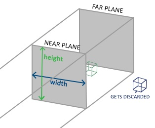
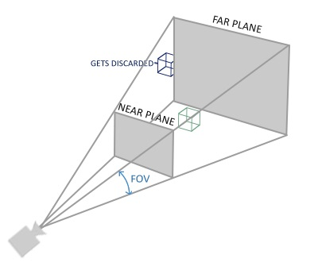

# 坐标系统

## 概述

在OpenGL中，每次顶点着色器运行之后，都希望把所有的顶点都转化为标准化设备坐标。然后将这些标准化设备坐标传入光栅器，将它们变换为屏幕上的二维坐标或像素

将坐标变换为标准化设备坐标，再变成屏幕坐标的步骤通常是分布进行。其中涉及到5个重要的坐标系统：

局部空间 -> 世界空间 -> 观察空间 -> 裁剪空间 -> 屏幕空间

将坐标从一个坐标系转换到另一个坐标系，需要用到几个变换矩阵，最重要的三个分别为模型矩阵，观察矩阵和投影矩阵。

1. `局部空间`通过`模型矩阵`变换为`世界空间`。
2. `世界空间`通过`观察矩阵`变换为`观察空间`。
3. `观察空间`通过`投影矩阵`变换为`裁剪空间`。
4. `裁剪空间`通过`视口变换`变换为`屏幕空间`。


## 局部空间

物体所在的空间，建模软件中的模型都是处在与局部空间当中。

## 世界空间

如果将物体导入到程序当中，每一个物体会被放置到一个更大的空间当中。每个物体的坐标都会通过变换来放置到合适的位置。这个变换通过模型矩阵来完成。模型矩阵定义了物体的位移，旋转和缩放，来把物体变换到一个合适的位置。

## 观察空间

观察空间是由摄像机的视角所观察到的空间。是将世界空间中的坐标转换为用户眼前的坐标的结果，这些通常是由一系列的位移和旋转的组合来完成，平移，旋转场景从而使得特定的对象被变换到摄像机的前方。这些组合在一起的变换通常存储在一个观察矩阵里，它被用来将世界坐标变换到观察空间。

## 裁剪空间

在一个顶点着色器运行的最后，OpenGL期望所有的坐标都能落在一个特定的范围内，且任何在这个范围之外的点都应该被裁剪掉。被裁剪掉的坐标就会被忽略，所以剩下的坐标就将变为屏幕上可见的片段。通过投影矩阵，能够将观察空间变换到裁剪空间。投影矩阵会将在一个指定的范围内的坐标变换为标准化设备坐标的范围`(-1.0, 1.0)`。所有在范围外的坐标不会被映射到在`-1.0`到`1.0`的范围之间，会被裁剪掉。

可以通过创建一个正摄投影矩阵或是一个透视投影矩阵来完成裁剪空间的转换，不同的投影矩阵定义了不同的平头截体，每个出现在平截头体范围内的坐标都会最终出现在用户的屏幕上。

## 正摄投影与透视投影

- 正摄投影

  正射投影矩阵定义了一个类似立方体的平截头箱，它定义了一个裁剪空间，在这空间之外的顶点都会被裁剪掉。创建一个正射投影矩阵需要指定可见平截头体的宽、高和长度。

  正射投影矩阵直接将坐标映射到2D平面中，不会产生真实的透视效果，如果需要考虑透视，需要透视投影矩阵来解决这个问题。

  

  `GLM`中的内置函数`glm::ortho`可以创建正摄投影矩阵。

  ```cpp
  //前两个参数指定了平截头体的左右坐标
  //第三和第四参数指定了平截头体的底部和顶部
  //通过这四个参数我们定义了近平面和远平面的大小
  //第五和第六个参数则定义了近平面和远平面的距离。
  glm::ortho(float left, float right, float bottom, float top, float zNear, float zFar)
  ```

- 透视投影

  透视投影矩阵将给定的平截头体范围映射到裁剪空间，除此之外还修改了每个顶点坐标的w值，从而使得离观察者越远的顶点坐标w分量越大。被变换到裁剪空间的坐标都会在-w到w的范围之间。OpenGL要求所有可见的坐标都落在-1.0到1.0范围内，作为顶点着色器最后的输出，因此，一旦坐标在裁剪空间内之后，透视除法就会被应用到裁剪空间坐标上：

  $$ out = \left( \begin{matrix}
     x/w \\
     y/w \\
     z/w
  \end{matrix} \right) $$

  

  `GLM`中的内置函数`glm::perspective`可以创建透视投影矩阵。

  ```cpp
  //第一个参数为视锥上下面之间的夹角
  //第二个参数为宽高比，即视窗的宽/高
  //第三第四个参数分别为近截面和远界面的深度
  glm::perspective(float fovy, float aspect, float zNear, float zFar);
  ```

## 组合矩阵

在拥有了模型矩阵，观察矩阵以及投影矩阵之后，一个顶点坐标通过以下过程被变换到裁剪坐标。

$$ V_{clip} = M_{projection} \cdot M_{view} \cdot M_{model} \cdot V_{local} $$

矩阵的运算顺序从右往左，最后的顶点被赋值到顶点着色器的`gl_Position`中。

## 左手坐标系与右手坐标系

- 坐标系表示法

  - 手心向内，手指向上。
  - 大拇指指向右方。
  - 食指指向上方。
  - 中指向下弯曲90度。

左手坐标系与右手坐标系`Z`轴朝向不同，右手坐标系`Z`轴正方向指向屏幕外侧，左手坐标系则指向屏幕内侧。

`OpenGL`使用右手坐标系。`DirectX`使用左手坐标系。
