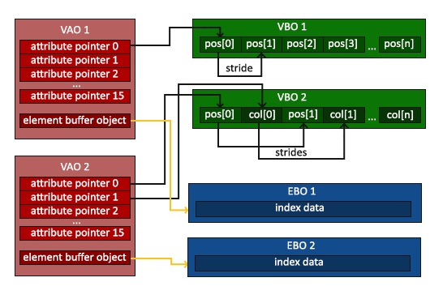

# OpenGL与基本概念

## OpenGL以及相关的库

- OpenGL：OpenGL本身并不是一个API，它仅仅是一个由Khronos组织制定并维护的规范。OpenGL自身是一个巨大的状态机，一系列的变量描述OpenGL此刻应当如何运行。OpenGL的状态通常被称为OpenGL上下文。通常使用如下途径去更改OpenGL状态：设置选项，操作缓冲，最后，使用当前OpenGL上下文来渲染。
- OpenGL工作流：当使用OpenGL中一个对象是，通常的工作流如下所示：

    ```cpp
    // OpenGL的状态
    struct OpenGL_Context {
        ...
        object* object_Window_Target;
        ...
    };

    // 创建对象
    unsigned int objectId = 0;
    glGenObject(1, &objectId);
    // 绑定对象至上下文
    glBindObject(GL_WINDOW_TARGET, objectId);
    // 设置当前绑定到 GL_WINDOW_TARGET 的对象的一些选项
    glSetObjectOption(GL_WINDOW_TARGET, GL_OPTION_WINDOW_WIDTH, 800);
    glSetObjectOption(GL_WINDOW_TARGET, GL_OPTION_WINDOW_HEIGHT, 600);
    // 将上下文对象设回默认
    glBindObject(GL_WINDOW_TARGET, 0);
    ```

- GLFW：这是一个专门针对OpenGL的C语言库，它提供了一些渲染物体所需的最低限度的接口。它允许用户创建OpenGL上下文，定义窗口参数以及处理用户输入。
- GLAD：因为OpenGL只是一个标准，具体的实现有驱动开发商针对特定显卡实现，大多数函数的位置无法在编译时确定下来，需要在运行时查询，开发者需要在运行时获取函数地址并将其保存在一个函数指针中供以后使用，取得地址的方法因平台而异，而GLAD这以开源库能够用于简化这个繁琐的过程。
- GLEW：作用与GLAD相似，但GLAD使用在线服务来生成库文件。

## VBO，VAO和EBO

- VBO：顶点缓冲对象，可以理解为一个缓冲容器，将需要渲染的顶点放在缓存中等待GPU去取用。
- VAO：顶点数组对象，以看作一个存放VBO的容器，VAO中存放着这次渲染需要使用的所有VBO的信息，VAO把VBO存放到特定位置，在需要时直接在这个位置取用VBO。
- EBO：索引缓冲对象，它专门储存索引，OpenGL调用这些顶点的索引来决定该绘制哪个顶点。


