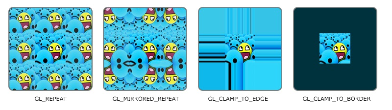

# 纹理

纹理可以为物体添加细节，为了把纹理映射到图形上，图形的每一个顶点都会关联一个纹理坐标，用来表明纹理图像的那个部分采样，之后在图形的其他片段上进行片段插值。

## 纹理的环绕方式

OpenGL提供了多种纹理环绕方式。

- GL_REPEAT：对纹理的默认行为。重复纹理图像。
- GL_MIRRORED_REPEAT：和GL_REPEAT一样，但每次重复图片是镜像放置的。
- GL_CLAMP_TO_EDGE：纹理坐标会被约束在0到1之间，超出的部分会重复纹理坐标的边缘，产生一种边缘被拉伸的效果。
- GL_CLAMP_TO_BORDER：超出的坐标为用户指定的边缘颜色。



## 纹理过滤

纹理坐标不依赖与分辨率，可以是任意浮点数。OpenGL将纹理像素映射到纹理坐标时需要进行纹理过滤，常用的过滤方法有两种。

- GL_NEAREST：邻近过滤，是OpenGL默认的纹理过滤方式。当设置为GL_NEAREST的时候，OpenGL会选择中心点最接近纹理坐标的那个像素。产生的效果类似于添加了锐化效果。
- GL_LINEAR：线性过滤，它会基于纹理坐标附近的纹理像素，计算出一个插值，近似出这些纹理像素之间的颜色。产生的效果类似于添加了模糊效果。

## 多级渐远纹理

简单来说就是一系列的纹理图像，后一个纹理图像是前一个的二分之一。多级渐远纹理背后的理念很简单：距观察者的距离超过一定的阈值，OpenGL会使用不同的多级渐远纹理，即最适合物体的距离的那个。由于距离远，解析度不高也不会被用户注意到。同时，多级渐远纹理另一加分之处是它的性能非常好。

在渲染中切换多级渐远纹理级别时，OpenGL在两个不同级别的多级渐远纹理层之间会产生不真实的生硬边界。为了指定不同多级渐远纹理级别之间的过滤方式，OpenGL提供了4中过滤方式。

- GL_NEAREST_MIPMAP_NEAREST：使用最邻近的多级渐远纹理来匹配像素大小，并使用邻近插值进行纹理采样。
- GL_LINEAR_MIPMAP_NEAREST：使用最邻近的多级渐远纹理级别，并使用线性插值进行采样。
- GL_NEAREST_MIPMAP_LINEAR：在两个最匹配像素大小的多级渐远纹理之间进行线性插值，使用邻近插值进行采样。
- GL_LINEAR_MIPMAP_LINEAR：在两个邻近的多级渐远纹理之间使用线性插值，并使用线性插值进行采样。

## 纹理生成步骤

```cpp
unsigned int texture;
glGenTextures(1, &texture);
glBindTexture(GL_TEXTURE_2D, texture);
// 为当前绑定的纹理对象设置环绕、过滤方式
glTexParameteri(GL_TEXTURE_2D, GL_TEXTURE_WRAP_S, GL_REPEAT);   
glTexParameteri(GL_TEXTURE_2D, GL_TEXTURE_WRAP_T, GL_REPEAT);
glTexParameteri(GL_TEXTURE_2D, GL_TEXTURE_MIN_FILTER, GL_LINEAR);
glTexParameteri(GL_TEXTURE_2D, GL_TEXTURE_MAG_FILTER, GL_LINEAR);
// 加载并生成纹理
int width, height, nrChannels;
//使用stb_image.h加载纹理
unsigned char *data = stbi_load("texture.jpg", &width, &height, &nrChannels, 0);
if (data)
{
    glTexImage2D(GL_TEXTURE_2D, 0, GL_RGB, width, height, 0, GL_RGB, GL_UNSIGNED_BYTE, data);
    glGenerateMipmap(GL_TEXTURE_2D);
}
else
{
    std::cout << "Failed to load texture" << std::endl;
}
//释放图像内存
stbi_image_free(data);
```
