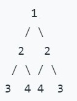

# 101. 对称二叉树

给定一个二叉树，检查它是否是镜像对称的。

例如，二叉树 [1,2,2,3,4,4,3] 是对称的。



但是下面这个 [1,2,2,null,3,null,3] 则不是镜像对称的:


## 题解

一颗二叉树若是镜像对称的，那么其左子树和翻转后的右子树完全相等。我们需要逐层遍历二叉树，判定两对称位置的节点（若有）是否值相等。给定两个指针`p1`,`p2`，分别指向左子树和右子树。若两子树的根节点相同，且左子树的左子树与右子树的右子树互为镜像，左子树的右子树与右子树的左子树互为镜像，那么这个树是镜像对称的。

可通过递归法求解，也可用迭代法求解。使用迭代法时，可利用队列来辅助求解。首先将根节点入队两次。主循环中每次弹出队首的两个节点`p1`和`p2`，比较其是否为空或相等，再将`p1`的左孩子，`p2`的右孩子，`p1`的右孩子，`p2`的左孩子（`p1`和`p2`的左右孩子交替入队即可）依次入队。若每次比对都成功，则最终返回`True`。

### Python

```python
# 递归法
# Definition for a binary tree node.
# class TreeNode:
#     def __init__(self, x):
#         self.val = x
#         self.left = None
#         self.right = None

class Solution:
    def isSymmetric(self, root: TreeNode) -> bool:
        def check(p1, p2):
            if not p1 and not p2:
                return True
            elif not p1 or not p2:
                return False
            return p1.val == p2.val and check(p1.left, p2.right) and check(p1.right,p2.left)
        if root == None:
            return True
        return check(root.left, root.right)
```

```python
# 迭代法
# Definition for a binary tree node.
# class TreeNode:
#     def __init__(self, x):
#         self.val = x
#         self.left = None
#         self.right = None

class Solution:
    def isSymmetric(self, root: TreeNode) -> bool:
        Q = [root, root]
        while Q != []:
            p1 = Q.pop(0)
            p2 = Q.pop(0)
            if p1 == None and p2 == None:
                continue
            elif p1 == None or p2 == None:
                return False
            elif p1.val != p2.val:
                return False
            else:
                Q.append(p1.left)
                Q.append(p2.right)
                Q.append(p1.right)
                Q.append(p2.left)
        return True
```
