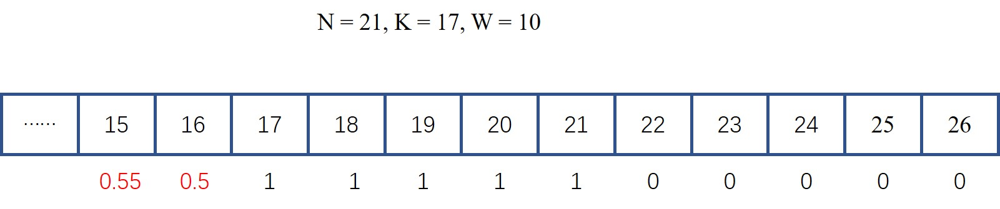

# 837. 新21点

爱丽丝参与一个大致基于纸牌游戏 “21点” 规则的游戏，描述如下：

爱丽丝以 0 分开始，并在她的得分少于 K 分时抽取数字。 抽取时，她从 [1, W] 的范围中随机获得一个整数作为分数进行累计，其中 W 是整数。 每次抽取都是独立的，其结果具有相同的概率。

当爱丽丝获得不少于 K 分时，她就停止抽取数字。 爱丽丝的分数不超过 N 的概率是多少？

> 示例 1：
> 
> 输入：N = 10, K = 1, W = 10
> 
> 输出：1.00000
> 
> 说明：爱丽丝得到一张卡，然后停止。


> 示例 2：
> 
> 输入：N = 6, K = 1, W = 10
> 
> 输出：0.60000
> 
> 说明：爱丽丝得到一张卡，然后停止。
> 
> 在 W = 10 的 6 种可能下，她的得分不超过 N = 6 分。

> 示例 3：
> 
> 输入：N = 21, K = 17, W = 10
> 
> 输出：0.73278

## 题解
动态规划。
拿到此题时，一脸懵逼- -！  不知道该如何求解概率。 看了LeetCode的官方解答后才终于会做了。
以示例3为例。显然当爱丽丝的得分为17-21时，分数不超过`N = 21`的概率为1，当得分大于21时，分数不超过`N = 21`的概率为1。现在假设爱丽丝的得分为16，而16小于`K = 17`，因此爱丽丝需要继续从`1~W`中抽卡，抽到`1`的概率为`1/W = 0.1`，抽到`2`的概率也为0.1，同样抽到`W`的概率也为0.1。而无论抽到几，都将结束抽卡。那么当爱丽丝的得分为16时，其再抽一张卡获胜（得分小于等于21）的概率为多少呢？

假设`dp[x]`表示当爱丽丝的得分为`x`时开始抽卡并获得胜利的概率。显然从上面的分析可以得到`dp[17]~dp[21]`均等于1，`dp[22]~dp[26]`均等于0，而`dp[16]`可通过下式计算：
$$dp[16] = 0.1*(dp[17]+dp[18]+\cdots+dp[26]) = 0.5$$
继续向前推导可得到：
$$dp[15] = 0.1*(dp[16]+dp[17]+\cdots+dp[25]) = 0.55$$


根据上述分析，我们可以很容易地归纳得到该题的递推表达式：
$$dp[x] = \frac{1}{W}(dp[x+1]+\cdots+dp[x+W])$$
此时`x`应满足`x < K`
当`K <= x <= min(N,K+W-1)`时有`dp[x] = 1`，而当`x > min(N,K+W-1)`时有`dp[x] = 0`。

为什么以`min(N,K+W-1)`作为分界线呢？显然依据题意，当`x > N`时，爱丽丝不可能获胜。而当`K+W-1 < N`时，由于爱丽丝的得分已经大于`K`了，故她不会再继续抽卡，而她能抽到的卡的得分最多为`K+W-1`，因此得分为大于`K+W-1`的概率为0。

上面的递推表达式存在大量重复计算，直接使用可能会超过时间限制，因此我们考虑对其进行优化。
由于
$$dp[x] = \frac{1}{W}(dp[x+1]+\cdots+dp[x+W])$$
$$dp[x+1] = \frac{1}{W}(dp[x+2]+\cdots+dp[x+W+1])$$
两式相减可得到
$$dp[x] = \frac{W+1}{W}dp[x+1] - \frac{1}{W}dp[x+W+1]$$
此时`x`应满足`x < K`。
而当`x = K`时有
$$dp[K] = \frac{1}{W}(dp[K+1]+\cdots+dp[K+W])$$
且`dp[K+1]~dp[min(N,K+W-1)]`均等于1，`dp[min(N,K+W-1)+1]~dp[K+W]`均等于0。
因此可得到
$$dp[K] = \frac{min(N,K+W-1)-K+1}{W} = \frac{min(N-K+1,W)-K+1}{W} $$


### Python版本

```python
class Solution:
    def new21Game(self, N: int, K: int, W: int) -> float:
        dp = [0]*(W+K)
        boundary = min(N, W+K-1)
        for i in range(K,boundary+1):
            dp[i] = 1
        dp[K-1] = min(N-K+1,W)/W
        for i in reversed(range(K-1)):
            dp[i] = (W+1)/W*dp[i+1] - dp[i+W+1]/W
        return dp[0]
```