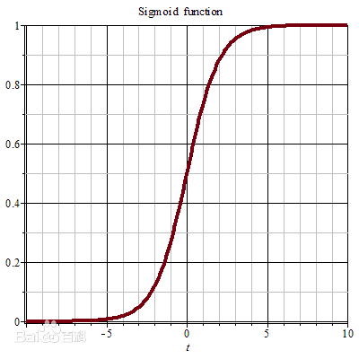
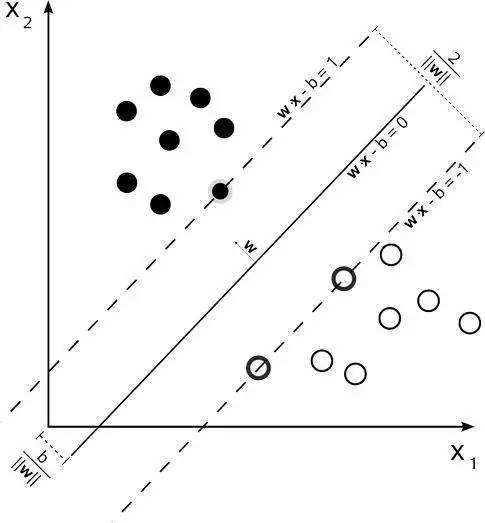

# 机器学习相关

## 极大似然估计
极大似然估计就是一种在样本已知、模型已知的情况下，反推模型参数的方法。

现有样本

定义似然函数

用我们聪明的脑子想一想，就知道似然函数的值必定是越大越有说服力，所以我们需要求使得出现该组样本的概率最大的值。但是现在的似然函数难以求导计算，我们可以转为取其对数进行求导。

对数似然函数为。

极大似然估计为。求导计算即可。

## 线性回归

一般用于解决预测问题。

## 逻辑回归 Logistic Regression
虽然带着回归两个字，但是LR是个彻头彻尾的分类算法。可以把“回归”二字理解为用回归的方法来做分类。

怎么用回归的方法来做分类呢？假定我们已经对线性回归找到了最佳参数，即已经通过线性回归找到了多个变量之间的某个规律。我们可以通过设定阈值来进行分类。但缺点是显而易见的：离群值（异常值）对结果的影响往往是巨大的。

LR的做法是把直线掰弯： 其中选用sigmoid来作为决策函数：。sigmoid的取值范围为(0,1)，在中心位置值为0.5，所以可以选取0.5作为阈值，来完成二分类任务。

设，由sigmoid的值域可知。推导过程如下：

对其求偏导：

## 支持向量机 Support Vector Machine

支持向量机的核心思想就是在两类样本（两类的label分别为+1和-1）中寻找一个决策面，这个决策面一般表示就是，我们需要找到一个最佳权值使得间隔最大。所以SVM的优化目标为：

再难一点的我也不会了……