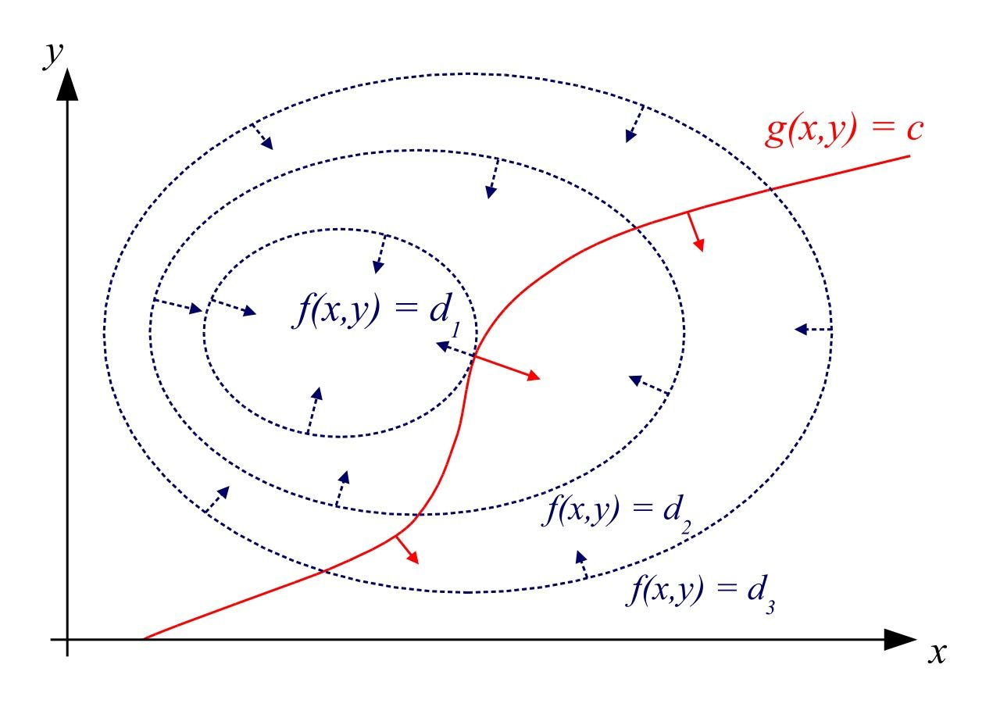
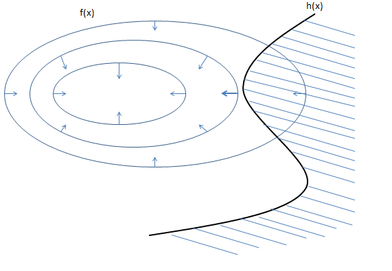

# 最优化

## 无约束最优化

### 梯度下降法

梯度下降法是最朴实最简单而又很有效的方法，它建立在：函数在点沿着梯度相反的方向下降最快。（具体证明过程太长了，而且我自己没推过，暂时先不写）

其中为学习率。没啥好写的了

### 牛顿法

可以从两个角度来解释牛顿法：

- 代数的方法（？？）
    
    通过高中数学可知，若求函数的极小/极大值，可寻找其导数为0的点。所以，求极值问题即为求导数的零点问题~

    所以，牛顿法可以用于 1.解方程 2.最优化
    

    设的根为r。给出初始点，过点作与相交的切线，切线方程为。取其与轴相交的点为，则。虽然求得的并不能让，但是的值比更接近。于是就可以迭代求解了

    ！注意，此处的本身即为导数（单纯是为了配合这张图）

    所以其实公式是这样的：

    

- 泰勒公式展开

    

    取前两项，后面的解释同上

## 有约束最优化

### 拉格朗日乘子法
将有等式约束优化问题转为无约束优化问题。

设给定目标函数为，约束条件为。

看起来就像下面这个图：

由图可以看出，等高线与约束线相切的时候取得极值。（数学证明我也不会……待填坑）

所以就可以得到：

所以拉格朗日乘子法就是

目的就是求解上面的那个方程组。计算的时候把约束条件要改写成标准形式。

### KKT条件
当约束为不等式的时候该怎么办呢？

设给定目标函数为，约束条件为，。

那么，只会有两种情况出现：极值在上（黑色线上），即该约束起作用；或极值在的范围内（斜线范围内），约束不起作用。

为包含所有可能的情况，则通过解下面这个方程组来得到答案：

这就是KKT条件了。

---

[在线latex转html](https://www.codecogs.com/latex/eqneditor.php)