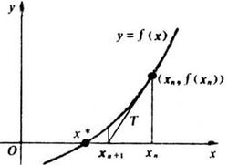

# 最优化

## 无约束最优化

### 梯度下降法

梯度下降法是最朴实最简单而又很有效的方法，它建立在：函数$f(x)$在$a$点沿着梯度相反的方向$-\nabla  f(a)$下降最快。（具体证明过程太长了，而且我自己没推过，暂时先不写）

$$x_n^{(i+1)}=x_n^{(i)}-\eta\frac{\partial f}{\partial x_n}(x^{(i)})$$

其中$\eta$为学习率。没啥好写的了

### 牛顿法

可以从两个角度来解释牛顿法：

- 代数的方法（？？）
    
    通过高中数学可知，若求函数的极小/极大值，可寻找其导数为0的点。所以，求极值问题即为求导数的零点问题~

    所以，牛顿法可以用于 1.解方程 2.最优化
    
    设$f(x)=0$的根为r。给出初始点$x_0$，过点$(x_0,f(x_0))$作与$y=f(x)$相交的切线，切线方程为$y=f(x_0)+f'(x_0)(x-x_0)$。取其与$x$轴相交的点为$x_1$，则$x_1=x_0-\frac{f(x_0)}{f'(x_1)}$。虽然求得的$x_1$并不能让$f(x)=0$，但是$f(x_1)$的值比$f(x_0)$更接近$f(x)=0$。于是就可以迭代求解了

    设的根为r。给出初始点$x_0$，过点$(x_0,f(x_0))$作与$y=f(x)$相交的切线，切线方程为$y=f(x_0)+f'(x_0)(x-x_0)$。取其与$x$轴相交的点为$x_1$，则$x_1=x_0-\frac{f(x_0)}{f'(x_1)}$。虽然求得的$x_1$并不能让$f(x)=0$，但是$f(x_1)$的值比$f(x_0)$更接近$f(x)=0$。于是就可以迭代求解了

    ！注意，此处的$f(x)$本身即为导数（单纯是为了配合这张图）

    所以其实公式是这样的：
    $$x_{n+1}=x_{n}-\frac{f'(x_n)}{f''(x_n)}$$

- 泰勒公式展开
    $$f(x)=\frac{f(x_0)}{0!}+\frac{f'(x_0)}{1!}(x-x_0)+\frac{f''(x_0)}{2!}(x-x_0)^2+...+\frac{f^{(n)}(x_0)}{n!}(x-x_0)^n+R_n(x)$$

    取前两项，后面的解释同上
