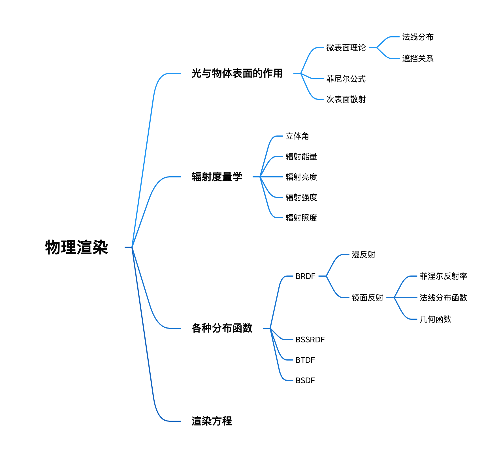
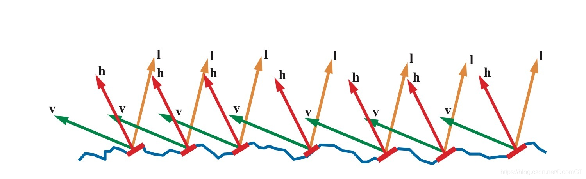
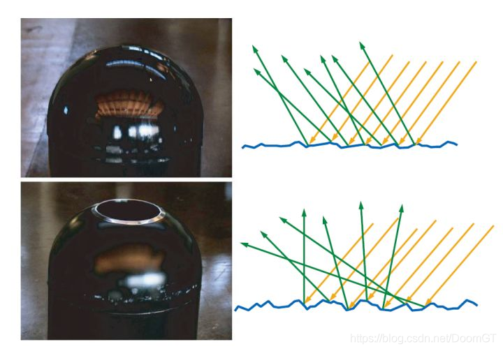
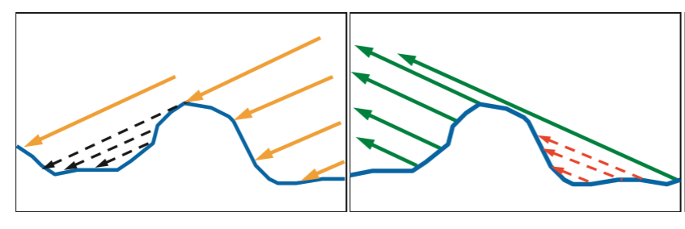
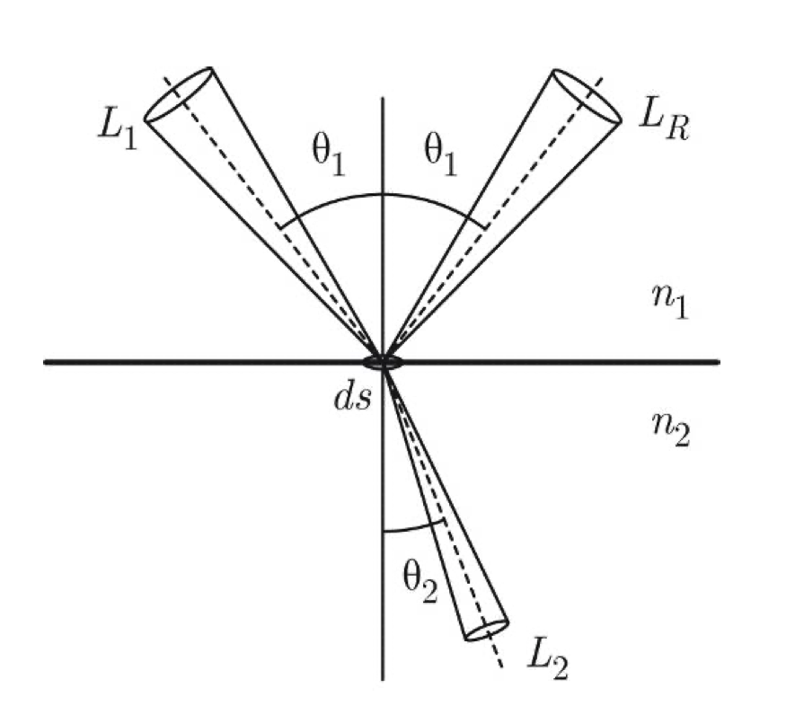
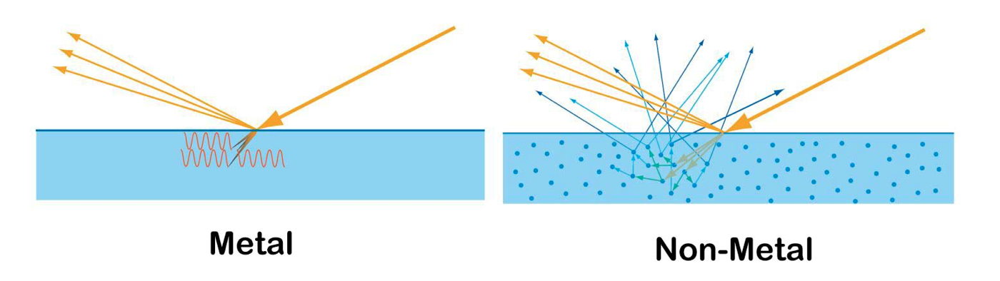
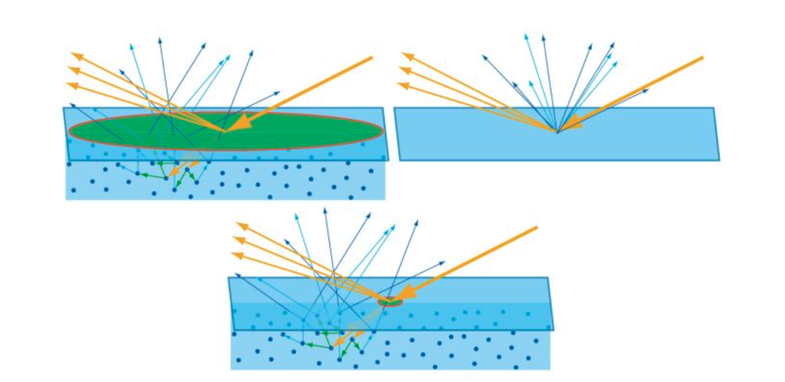
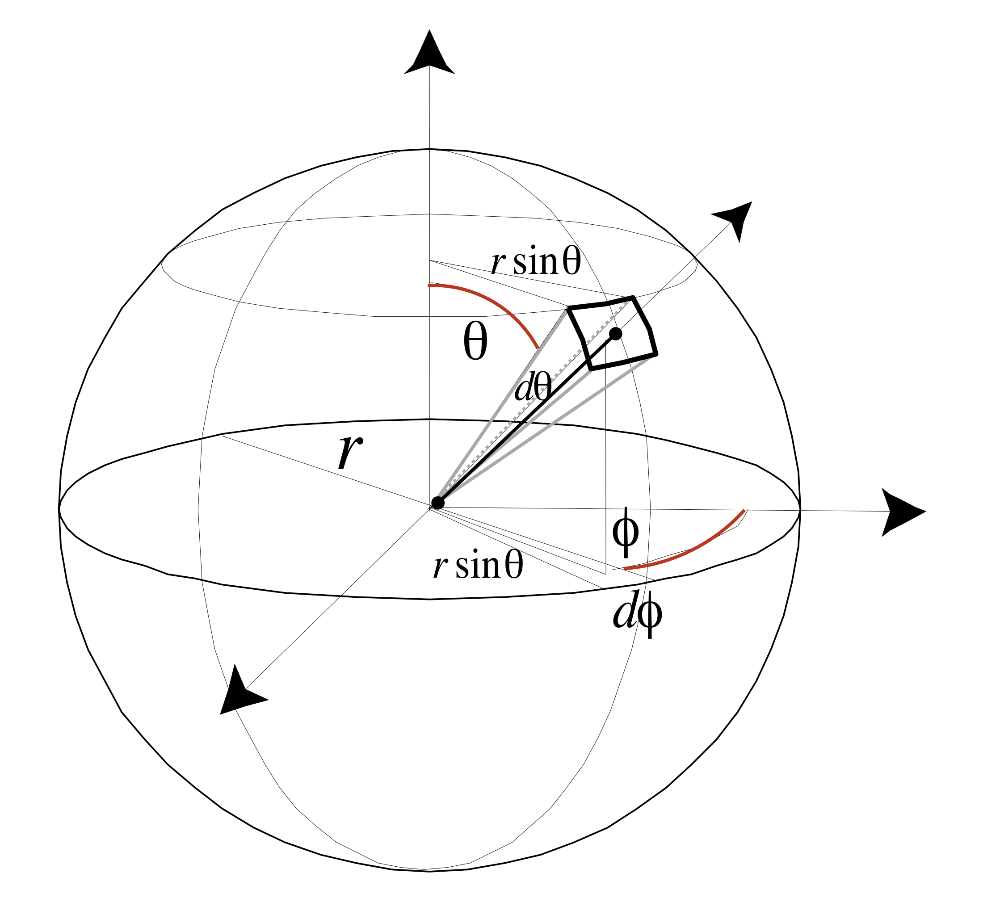
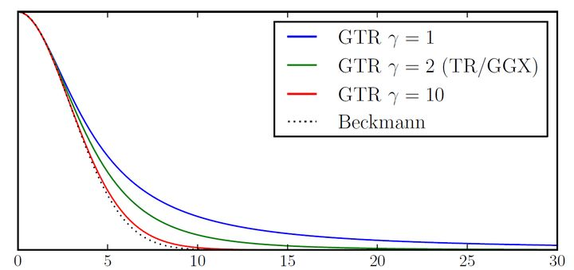
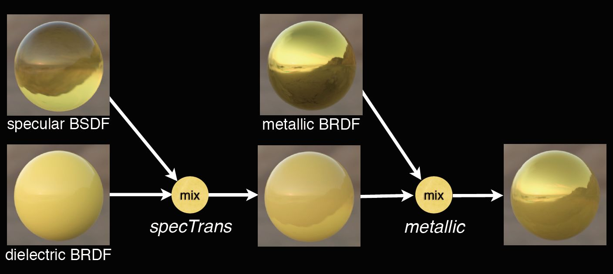

# 物理渲染(PBR)与渲染方程(Render Equation)

首先附上本文内容结构

物理渲染，顾名思义就是基于物理的渲染。指在渲染时使用数学模型去描述光线传播的物理规律，而使渲染出来的结果具备一定的物理正确性。

想把物理渲染搞明白，可以将其体系分为以下三个部分：

- 光与物体表面的作用
- 辐射度量学
- 光线分布函数(BxDF)

## 微表面理论

首先我们就先来理一理这个微表面理论。

微表面理论可以分为两个部分进行解释，即微表面结构的法线分布函数以及表面之间互相遮挡的几何关系。

### 法线分布函数

微表面理论认为我们平时看到的物体表面上的一点由许多朝向不同且光滑的微小表面组成。如下图

当我们从$v$方向看向这个表面，并且入射光的方向为$l$时，只有法线方向为$h$的平面能够被我们看到。因此我们平时看到的物体表面可以看作时这样的微小表面的大集合，表面上的每个点都会以略微不同的角度对入射光进行反射，而最终被我们看到的结果则是这些方向有着微小差异的反射光的共同作用的结果。

在微观尺度上，表面越是光滑，则每一个微表面的反射光的方向的越是整齐，与宏观表面方向的偏离幅度越小，就能产生越清晰的反射。表面越是粗糙，则每一个微表面的反射光方向偏移就越大，入射光线更趋向于向完全不同的方向发散开来，在宏观尺度上则产生越模糊的反射。

这些在微观结构的表面无法通过分析的方法进行精确模拟，因此只能通过统计的方式来模拟这写微观结构的分布。而用来表示这些微表面法线方向分布的函数就是法线分布函数(normal distribution function, NDF)。

### 几何函数

然而，并不是所有法线处于$h$方向的表面都能顺利被观察到，其中有一些面片会因为在光源方向或是观察方向上被其他面片所遮挡。尽管在实际情况中这些被遮挡的光线经过几次反射最终仍然有可能进入人眼，但是一般忽略这种复杂的情况。而用来表示这些微表面直接的互相遮挡关系的函数就是几何函数了。

微表面理论的理论概念大概就是这些，但是具体的法线分布函数与几何函数该如何去选取，我们留到后面再讲。

## 菲涅尔公式

我们在讨论微表面理论的时候仅仅考虑了入射光线在物体表面的反射，而从来没有提到过光线在物体表面的折射。而事实上，当光从一个一个介质进入到另一个不同介质的时候，多多稍稍会有一部分的光进入介质，也就是发生折射。那么我们就需要知道光在进入另一个介质的时候，反射光与折射光的比率是多少。而这时就需要引入菲涅耳公式进行解释。

菲尼尔方程描述了当光从一种介质进入到另一种介质时，反射光与折射光的比率。如果使用$R_F$来表示菲尼尔反射率，那么根据能量守恒定律，折射的辐射能量比率就为$1-R_F$。然而事实上并不是这样，因为在形成折射时，由于折射角度的改变使得折射所形成的立体角也被改变，如上图所示。

假设入射光的辐射亮度为$L1$，表示辐射通量$d^2\Phi_1(\theta_1, \phi_1)$从方向$(\theta_1, \phi_1)$穿过无限小立体角$d\omega_1=sin\theta_1d\theta_1d\phi_1$，照射到面积为$ds$大小区域的能量。即

$$ L_1 = \frac{d^2\Phi_1(\theta_1, \phi_1)}{ds\cos\theta_1\sin\theta_1d\theta_1d\phi_1} $$

因此反射辐射亮度$L_R$可以表示为

$$ L_R = R_F(\theta_1)L_1 $$

经过推导（具体推导过程就不在这里展开了），可以推出折射后的辐射亮度为

$$ L_2 = (1-R_F(\theta_1))\frac{n^2_2}{n^2_1}L_1 $$

由于菲涅尔公式的曲线非常复杂，因此在渲染领域通常不会使用原始的菲尼尔公式，而是使用Schlick提出的近似方程，方程如下

$$ R_F(\theta_i)\approx R_F(0\degree)+(1-R_F(0\degree))(1-\cos\theta_i)^5 $$

$$ R_F(0\degree)=(\frac{n_1-n_2}{n_1+n_2})^2 $$

## 次表面散射

以上讨论了光的反射与折射，然而，对于非金属与金属而言，光的折射也会产生不同的现象。

对于金属而言，光从表面进入进入之后，折射光会立刻被金属吸收（能量被自由电子吸收）。而对于非金属而言，光线会进入物体内部，经过一定的散射活吸收，然后重新从物体表面散射出来。这种现象被称之为次表面散射。次表面散射使得物体表面很浅的部分看起来具有一定的透明度，例如人耳朵出比较薄的皮肤等。

次表面散射的本质上与漫反射是相同的现象。唯一的区别则是相对于观察尺度的散射距离。如果重新从物体内部散射出来的光的散射位置距离入射点的位置之间的距离小于一个像素，那么这个散射就可以被当作漫反射来进行处理。而如果这个距离大于一个像素或者达到了一定程度，则需要被当作次表面散射现象进行处理。

## 辐射度量学

辐射度量学为光学中关于光的测量的一个分支。辐射度量学被引入计算机图形学用于测量与计算图形学中光的传播，并借此推导出渲染方程。辐射度量学的引入使得渲染方程保留两个基本特性，即赫姆霍兹互反律以及能量守恒。

赫姆霍兹互反律即表示入射光与出射光的方向可以互换，其值保持不变。而能量守恒能够确保模型能够达到非常真实的图形品质。而像bling-phong光照模型等模型则无法保证能量守恒，因此也无法做到逼近真实水平的渲染品质。

在了解辐射度量学在图形学中的应用之前，首先需要对几个概念进行解释。

### 立体角

在几何学中，立体角是2D角度的概念在3D空间的延伸。立体角的定义为以锥体的顶点为球心作球面，该锥体在球表面截取的面积与球半径平方之比，单位为球面度(sr)。立体角通常用$\Omega$进行表示。

因此就有了如下推导

$$ \Omega = A/r^2 $$

$$ dA = (rd \theta)(r \sin\theta d\phi) = r^2 \sin\theta d\theta d\phi $$

$$ d\omega = dA / r^2 = \sin\theta d\theta d\phi $$

其中$d\omega$就是单位立体角了。因此如果对所有的单位立体角进行积分的话

$$ \Omega = \int_{S^2} d\omega = \int^{2\pi}_{0} \int^{\pi}_{0} \sin\theta d\theta d\phi = 4\pi $$

### 辐射能量(Radiant Energy) 

辐射能量是在辐射度量学中最基本的单位，表示为$Q$，单位为J(焦耳)。辐射能量是以辐射的形式发射，传播或接收的能量。每个光子都携带一定的能量，这个能量正比与它的频率$v$，即

$$ Q=hv $$

其中$h$为普朗克常数。光子的频率影响着光子与物体表面的交互，影响着光与感应器之间的作用，使不同频率的光被察觉为不同的颜色。在可见光谱中蓝光比红光具有更高的能量。

### 辐射通量(Radiant Flux)

辐射通量表示光源每秒钟发射的功率，记为$\Phi$，单位为W(瓦特)，即

$$ \Phi = dQ /dt $$

### 辐射亮度(Radiance)

辐射亮度表示从一个面A射出的光能量。这个面可能是虚构的也可能是光源的真实的辐射面或是固体的一个受照面。如果固体是不透明的，通常考虑的是反射光，如果固体是透明的，通常考虑的是透射光。

用更简单的话来讲，辐射亮度表示的是某个点在某个方向上的亮度，在图形学中表示一束光的亮度，也是渲染方程所最终需要计算的量。

现在假设P是在A面上的一个点，在P点处去一个面元$dA$，并在某一个方向取一个立体角$d\omega$，并且立体角$d\omega$方向与面元$dA$的法线方向夹角为$\theta$，则单位时间内由面元$dA$发射到$d\omega$的能量的值$d\Phi$可以表示为

$$ d\Phi=L\cos\theta dAd\omega $$

由于光无法反射到A面的背面，因此$\cos\theta$始终大于0。$L$则被称作在点$P(\xi, \eta)$处，方向$(\alpha, \beta)$上的辐射亮度，与$\xi, \eta, \alpha, \beta$四个参数相关，单位为$W/(m^2\cdot sr)$。

$$ L = L(\xi, \eta, \alpha, \beta) $$

为了描述$d\Phi$与$d\omega$与$dA$之间的关系，通常将其分解为两个量的乘积

$$ d\Phi=dId\omega=dEdA $$

在这个式子中，$I$与$E$则分别代表辐射强度与辐射照度这两个度量。

### 辐射强度(Radiant Intensity)

由上面的式子可以推出

$$ dI = \frac{d\Phi}{d\omega} = L\cos\theta dA $$

对一个面A进行积分

$$ I(\alpha, \beta) = \int L\cos\theta dA $$

$I$就被称为面A的辐射强度。因此辐射强度指一个面A在某一个方向上所投送的辐射通量。单位为$W/sr$。$I$是一个与距离无关的量，但是与发射面A的面积有关。

如果L与方向无关，则称此时的辐射是各向同性的，如果辐射为各项同性，并且辐射面是平面，则上式可以简化为

$$ I(\alpha, \beta) = I_0 \cos\theta $$ 

$$ I_0 = \int LdA $$

这时候任何方向上的辐射强度随该方向与面法线间夹角的余弦的变化而变化。这个公式被成为朗伯余弦定理。如果这个面是一个发射面，则称为漫发射，反射面则被称为漫反射。如果一个辐射源其表面辐射亮度不随方向变化，则称为朗伯体。

### 辐射照度(Irradiance)

同由上面的式子可以推出

$$ dE = \frac{d\Phi}{dA} = L\cos\theta d\omega $$

对立体角进行积分

$$ E(\xi, \eta) = \int L\cos\theta d\omega $$

E就被称为点$(\xi, \eta)$的辐射照度。因此辐射照度指在一个点处延各个方向投射的辐射通量的总和。单位为$W/m^2$。

由于辐射照度表示一个点接收的来自各个方向的辐射亮度，因此在图形学中被用来表述表面的一个点所接收的所有光照。因此辐射照度是漫反射表面的重要度量。事实上光照贴图中存储的正是辐射照度值。

假设$dA$是一个球面点P处的面元，球半径为$r$，$\theta$为球心到点P所连成的直线与$dA$处的法线夹角，则光源在单位时间内射过$dA$的能量为$Id\omega$。$d\omega$为$dA$所处的立体角，可以得到

$$ \cos\theta dA = r^2 d\omega $$

结合公式

$$ d\Phi=dId\omega=dEdA $$

可得

$$ E = \frac{I\cos\theta}{r^2} $$

该公式就是辐射度量学的基本方程，表达了所谓的照度余弦定律，即$E$与$\cos\theta$成正比，与距离的平方成反比。也就是说，一个光源距离该表面越远，其光照对该表面的影响就越小。

## 各种分布函数(BxDF)

BxDF是对双向反射/散射/折射等分布函数的统称，这些模型用于描述物体表面如何与光进行交互。BRDF为最常用的双向反射分布函数，同样BRDF的各种近似模型也在实时渲染当中得到了广泛的应用。如果考虑一部分光线透过物体表面，在内部进行多次弹射之后在物体表面另一个点出射，也就是常说的次表面散射的影响，BRDF就变为了双向次表面散射反射分布函数BSSRDF。而BRDF正是BSSRDF的其中一种特殊情况。BSDF为双向散射分布函数，其中包含了双向反射分布函数BRDF以及双向折射分布函数BTDF两个部分。那么以下对这些函数逐个进行说明。

## BRDF

BRDF即双向反射分布函数，用来表示物体表面反射方向上的辐射亮度增量与入射方向辐射照度增量的比率，即

$$ f_r(\omega_i, \omega_r) = \frac{dL_r(\omega_r)}{dE_i(\omega_i)} = \frac{dL_r(\omega_r)}{L_i(\omega_i)\cos\theta_id\omega_i} $$

其中$\omega_i$表示入射光方向，$\omega_r$表示观察方向或者反射光的方向。BRDF的单位为$sr^{-1}$，因此从直观上讲，BRDF的值就表示入射光方向单位立体角的能量在反射方向上反射的比率。

因此，假如给定一个BRDF函数，我们便可以求出该点处延观察方向的辐射亮度，其值为入射方向的辐射亮度乘上BRDF函数，再乘一个余弦因子后沿该点法线方向半空间的积分，即

$$ L_r(\omega_r) = \int_\Omega f_r(\omega_i, \omega_r)\cdot l_i(\omega_i)\cos\theta_id\omega_i $$

这个式子也被称为反射方程，是最终组成渲染方程的一部分。

那么问题来了，最终我们该如何去求得BRDF的值呢，或者说，我们怎么推导出一个物体的表面到底是如何与光线作用的呢。

还记得前面提到的微表面模型理论与菲涅尔公式，描述了光在物体表面的反射与折射现象。因此基于以上理论，我们可以得到一个对于各项同性的BRDF模型

$$ f(l,v) = f_d + \frac{R_F(\theta_h)G(\theta_l,\theta_v)D(\theta_h)}{4\cos\theta_l\cos\theta_v} $$

这个方程中一共包含漫反射与镜面反射两个部分。其中漫反射通常与方向无关，为一个常数，即$f_d$部分。剩下的部分则是镜面反射部分。其中又包含三个部分，分别为菲涅尔反射率$R_F(\theta_h)$，表示几何遮挡关系的几何函数$G(\theta_l,\theta_v)$，以及微面元法线分布函数$D(\theta_h)$。其中$D(\theta_h)$必须是归一化的。$\theta_i$和$\theta_v$分别表示入射方向与观察方向与表面法线的夹角，$\theta_h$表示表面法线与半矢量之间的夹角。式中的分母部分则表示一个微观面元空间向宏观像素空间转变的转换因子，因为$f(l,v)$表示宏观空间的一个度量。如此一来，整一个BRDF模型就被构造出来了。这个模型也被称作microfacet Cook-Torrance BRDF着色模型。

### 漫反射项

我们先来讨论BRDF中的漫反射项。

工业中流行的漫反射方案是Lambert BRDF，即

$$ f_d(l,v) = \frac{c_{diff}}{\pi} $$

该模型假设折射进入表面内部的光已经经历了足够多的散射，因此失去了方向性，从而在各个方向的反射率都为一个常数。然而在现实生活中很少由材质是这样。物体的微观结构导致的粗糙度不但对镜面反射产生影响，也会对漫反射产生影响。当微观面元的结构大于次表面散射的结构时，将导致一种回射反射(retro-reflection)，即光反射回到光源的方向。这种回射反射是由微观面元之间的遮挡导致。当观察方向不同于光源方向时，这种遮挡会大大减少被光照到的面积，从而减少漫反射的面积。

因此，Disney使用了一种新的漫反射经验模型

$$ f_d = \frac{baseColor}{\pi}(1+(F_{D90}-1)(1-\cos\theta_t)^5)(1+(F_{D90}-1)(1-\cos\theta_v)^5) $$

$$ F_{D90}=0.5+2(roughness)\cos^2\theta_d $$

对于比较光滑的表面，其镜面反射占主导，留给漫反射的光更少，回射反射呈下降趋势。对于粗糙的表面，回射反射则更加明显。在式子中，由于光首先折射进入表面，经过一定的散射之后重新射回原介质，因此右边的因子进行了两次计算。

那么组成镜面反射的三个部分该分别如何计算呢，接下去我们进行一一讨论。

### 菲涅尔反射率(Fresnel Reflectance Function)(R)

首先是菲涅尔反射率，目前工业中比较广泛的解决方案依旧是使用Schlick进行近似，也就是前文所提到的公式。

$$ R_F(\theta_i)\approx R_F(0\degree)+(1-R_F(0\degree))(1-\cos\theta_i)^5 $$

$$ R_F(0\degree)=(\frac{n_1-n_2}{n_1+n_2})^2 $$

### 法线分布函数(Normal Distribution Function)(D)

正如前文所说，法线分布函数NDF表示在微观几何结构中，所有微观面元的法线面向不同方向的概率，它决定了镜面反射部分的宽度，形状以及一些其他特征。工业中比较流行的NDF包括Beckmann，Phong，GGX等分布函数。然而，根据Disney对MERL BRDF数据分析法线，对于镜面反射BRDF球状分布，它具有一个很长的脱尾。而传统的Blinn Phong分布与Gaussian分布都不能有效地表达这种拖尾效应。同时，Disney也法线只有GGX分布具有最长的拖尾效应，而GGX实际上具有和Trowbridge-Reitz一样的表示，即

$$ D_{TR}=c/(a^2\cos^2\theta_h+\sin^2\theta_h)^2 $$

其中$c$表示缩放常数，$a$表示表面粗糙度，介于0和1之间。当为0时表示一个绝对光滑的分布，当为1时表示表面绝对粗糙，所有的反射光都是漫反射光。

同时，通过Trowbridge-Reitz分布与来自Berry的的分布函数相比较，Disney法线这两者具有十分相似的形式，而后者的指数部分取值为1.这就使得这个分布函数变化为一个更一般的分布函数形式，并取名为Generalized-Trowbridge-Reitz(GTR)分布函数。

$$ D_{TR}=c/(a^2\cos^2\theta_h+\sin^2\theta_h)^\lambda $$

可以发现当指数为1时，GTR函数即为Berry分布，当指数为2时，即为Trowbridge-Reitz分布。

然而GGX函数仍旧不足以表达更多的光泽细节。Disney经过研究法线单一的光泽叶(specular lobe)分布并不能精确的描述真实物体的光泽性质，因此他们使用了2个光泽叶组合来表达这种更长的拖尾，一个GTR指数取1（次级光泽叶），另一个GTR指数取2（主光泽叶）。并且对于粗糙的，选择使用$a=roughness^2$来产生一个更加线性的变化。

而对于各项异性的法线分布函数，粗糙度将随着方位角$\phi$变化，因此$\frac{1}{\alpha^2}$可以被$\frac{\cos^2\phi}{\alpha^2_x}+\frac{\sin^2\phi}{\alpha^2_y}$替换，其中

$$ \alpha_x = roughness^2/aspect $$

$$ \alpha_y = roughness^2\cdot aspect $$

$$ aspect = \sqrt{1-0.9anisotropic} $$

其中anisotropic与roughness都为材质参数。

### 几何函数(Geometry Function)(G)

几何函数也被称作双向阴影遮挡函数(bidirectional shadowing-masking function)，用来描述那些具有半矢量法线的微表面中，有多少比例是同时被入射方向与反射方向看见的。因此该函数的值也是介于0到1之间。

由于几何函数的计算通常要依赖与法线分布函数，因此工业中通常都是先使用法线分布函数按照史密斯阴影函数推导出真实的几何遮挡函数，然后再取一个近似函数，而这个近似函数大多能直接通过roughness参数来进行计算。

史密斯阴影函数的形式为

$$ G_1(v,h) = \frac{\chi^+(v\cdot h)}{1 + \Lambda(v)} $$

$$ \Lambda(m) = \frac{-1+\sqrt{1+\alpha^2\tan^2(\theta_m)}}{2} $$

其中$\chi^+(\alpha)$在$\alpha > 0$时为1，$\alpha \leq0$时为0。

在这里，史密斯阴影函数做了一个近似，即假设入射遮挡和出射遮挡时不相关的，因此这两个部分可以分别被分离出来，并且都是由NDF决定，并拥有相同的计算公式，即

$$ G(v,l,h)\approx G_1(v,h)G_1(l,h) =  \frac{\chi^+(v\cdot h)}{1 + \Lambda(v)} \cdot \frac{\chi^+(l\cdot h)}{1 + \Lambda(v)}$$

而近年来越来越多的引擎开始考虑入射遮挡与出射遮挡的相关性，因此这里给出一个更加精确的几何遮挡函数

$$ G(v,l,h,\alpha)=\frac{\chi^+(v\cdot h)\chi^+(l\cdot h)}{1+\Lambda(v)+\Lambda(l)} $$

在Disney的BRDF模型中，他们使用一个混合的方法，对主光泽叶使用Walter给出的GGX近似方法

$$ G_1(v,h) = \chi^+(\frac{v\cdot h}{v\cdot n})\frac{2}{1+\sqrt{1+\alpha^2_g\tan^2\theta_v}} $$

$$ \alpha_g=(0.5+roughness/2)^2 $$

以此来将粗糙度参数$\alpha_g$从$[0,1]$映射到$[0.25,1]$来使$G$函数随着粗糙度的变化更加平滑。对于次级光泽叶，粗糙度参数直接使用一个固定值0.25。

但是在2014年，Brent Burley对该模型进行了一次修订，针对次级光泽叶，去掉了这种重映射，而采用了Heitz的各项异性形式，即

$$ \Lambda(\omega_0) = \frac{-1+\sqrt{1+\frac{1}{\alpha^2}}}{2} $$

$$ \alpha = \frac{1}{\alpha_0\tan\theta_0} $$

$$ \alpha_0 = \sqrt{\cos^2\phi_0\alpha^2_x+\sin^2\phi_0\alpha^2_y} $$

同时使用了上文中入射遮挡与出射遮挡具有相关性的函数来替代史密斯阴影函数以获得一个更加准确的结果。

而在UE4中，则选择使用Schlick近似模型，并修改$k=\alpha / 2$以更接近史密斯GGX近似，同时仍然采用Disney对粗糙度的重映射，即

$$ k=\frac{(roughness+1)^2}{8} $$

$$ G_1(v)=\frac{n\cdot v}{(n\cdot v)(1-k)+k} $$

$$ G(l,v,h) = G_1(l)G_1(v) $$

## BSSRDF

在BRDF中，并没有考虑如果光进入物体表面，进入一定的散射之后，离开表面的点的距离与入射点的距离大于一个像素的情况。如果要考虑这种情况，则需要一种更加一般的函数来进行表示，这个函数就被称为双向表面散射反射分布函数。

BSSRDF在BRDF的基础上增加了一个在表面上入射点和一个出射点的位置，因此它由一个四维的方程变成了八维的方程。而BRDF则可被视为BSSRDF的一种特殊情况。

## BTDF

BTDF为双向折射分布函数，它的形式与BRDF的形式基本一样，唯一的区别是BTDF的观察方向是在折射方向的范围之内。

BDTDF同样基于微表面理论，即宏观表面由多个微观面组成，每个面元绝对光滑，光的折射遵循折射定律。假设入射光沿入射方向$i$从介质折射率为$\eta_i$的介质，折射进入介质折射率为$\eta_o$的介质，经过折射后从方向$o$进行观察，根据折射定律可以得到

$$ \eta_i\sin\theta_i=\eta_o\sin\theta_o $$

因此可以定义一个相对折射率(relative IOR)

$$ \eta=\eta_o/\eta_i $$

Walter首先定义了一个在折射范围内观察的半矢量$h_t$

$$ h_t=-\frac{i+\eta o}{|i+\eta o|} $$

因此Walter定义的BTDF可以写为

$$ f_t(i,o,n)=\frac{|i\cdot h_t|}{|i\cdot n|}\frac{|o\cdot h_t|}{|o\cdot n|}\cdot\frac{\eta^2}{(i\cdot h_t+\eta(o\cdot h_t))^2}\cdot(1-R_F(i,h_t))G(i,o,h_t)D(h_t) $$

折射定律不仅描述光在折射时弯曲的现象，也间接地约束了光在折射方向发散的范围，$\eta^2$同样也是光束发散范围的缩放因子。

## BSDF

BSDF为双向散射分布函数，它其实是BRDF与BTDF的总和，表示给定某点的入射方向与出射方向，出射方向上辐射亮度增量与入射方向上辐射照度增量的比率。

在前文讲述的Disney BRDF模型中，菲尼尔反射率使用了Schlick近似，然而它却不适用于折射，因此在Disney BSDF模型中，他们使用了原始的菲尼尔公式，即

$$ F(\theta_i,\eta) = \begin{cases}
\frac{1}{2}[(\frac{\cos\theta_i-\eta\cos\theta_t}{\cos\theta_i+\eta\cos\theta_t})^2+(\frac{\cos\theta_t-\eta\cos\theta_i}{\cos\theta_t+\eta\cos\theta_i})^2] & \cos^2\theta_t > 0 \\
1 & other
\end{cases} $$

但是对于金属BRDF，漫反射以及次级光泽叶，依旧使用Schlick近似来进行计算。

Disney BRDF模型本质上是金属和非金属的混合型模型，对于Disney BSDF，Disney仍然延续了之前的设计理念，采用了混合的方式并结合已有的Disney BRDF模型进行实现。如下图所示

Disney新增了⼀个参数specTrans（镜面反射透明度）来控制BRDF 和BSDF的混合。基于specTrans完成混合后，再使用和Disney BRDF类似的方式，基于metallic再进行一次混合。

即Disney BRDF模型的本质是金属BRDF、非金属BRDF、与Specular BSDF三者的混合型模型。在整个模型中，由于每个模块都是能量守恒的，因此混合后的模型也是能量守恒的。

## 渲染方程

有了上面的一些铺垫，我们终于可以去理解和推导渲染方程了。

和前面不同，我们用$L_(x\rightarrow\omega_o)$表示光从$x$方向向$\omega_o$发射，箭头用来表示光束的方向。

假设$L_e(x\rightarrow\omega_o)$表示光源或发光物体在$x$处沿$\omega_o$方向的辐射亮度，$L_r(x\rightarrow\omega_o)$表示物体在$x$处沿$\omega_o$的来自反射或折射的辐射亮度，根据能量守恒定律可得

$$ L_(x\rightarrow\omega_o) = L_e(x\rightarrow\omega_o) + L_r(x\rightarrow\omega_o) $$

通过BRDF的定义

$$ f_r(x,\omega_i\rightarrow\omega_o) = \frac{dL_r(x\rightarrow\omega_o)}{dE(x\leftarrow\omega_i)} $$

可以得到

$$ L_r(x\rightarrow\omega_o) = \int_{\Omega_x} f_r(x,\omega_i\rightarrow\omega_o)L(x\leftarrow\omega_i)cos(N_x,\omega_i)d\omega_{\omega_i} $$

其中$\Omega_x$表示沿$x$点法线方向的半空间，如果是折射光则是法线反方向的半空间。因此我们可以得到最终的渲染方程为

$$ L_(x\rightarrow\omega_o) = L_e(x\rightarrow\omega_o) + \int_{\Omega_x} f_r(x,\omega_i\rightarrow\omega_o)L(x\leftarrow\omega_i)cos(N_x,\omega_i)d\omega_{\omega_i} $$
