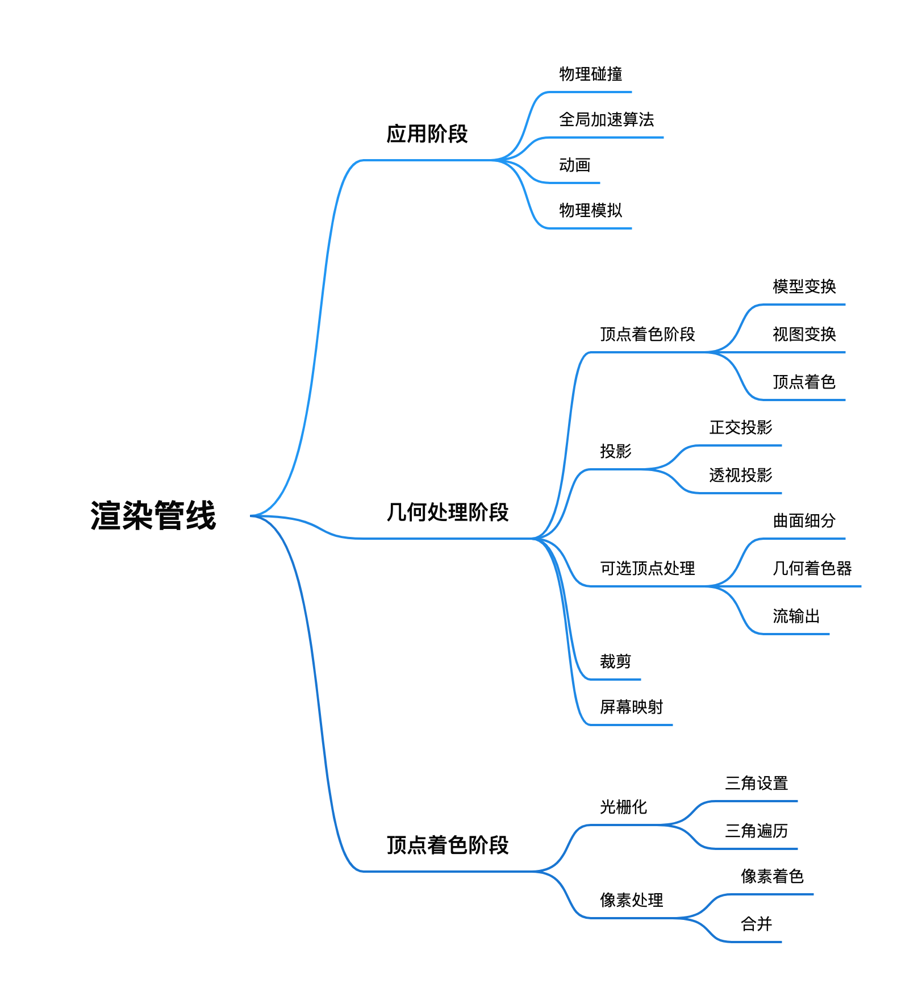
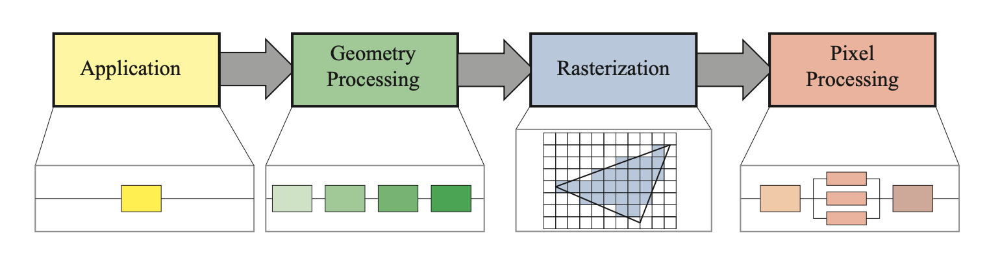
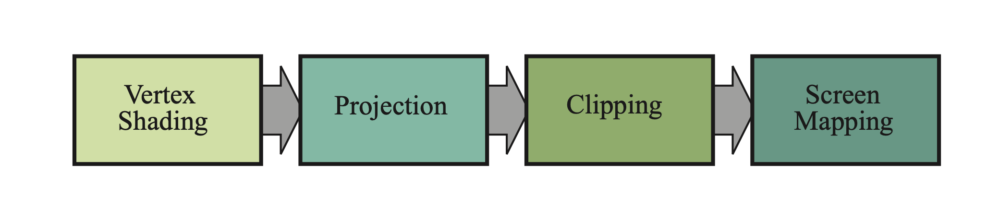
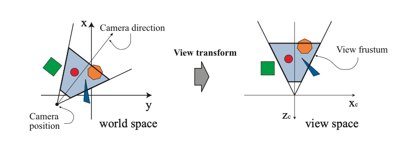
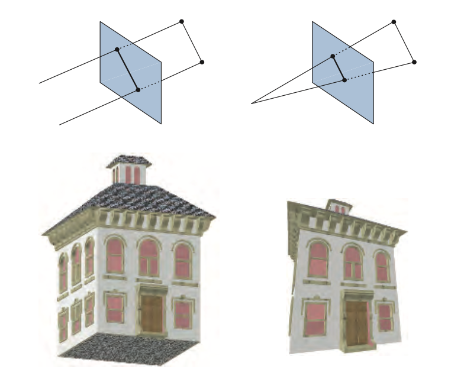
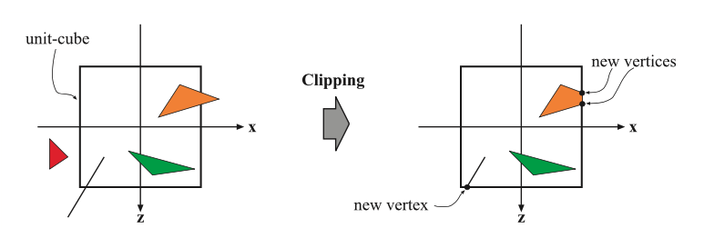
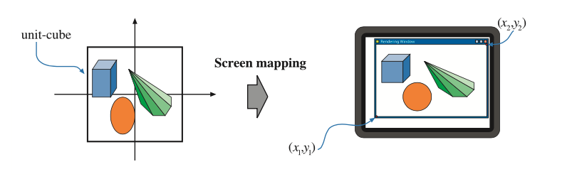
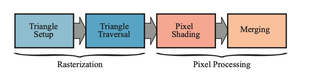

# 图形渲染管线

首先附上本文的内容结构

## 图形渲染管线架构

图形渲染管线一般分为应用阶段(Application)，几何处理阶段(Geometry Processing)，光栅化阶段(Rasterization)，像素处理阶段(Pixel Processing)。

渲染管线中每个阶段的并行是使用管线能够提升执行效率的主要原因。

管线中的每一个阶段通常他本身也是一条管线，其中包含数个子阶段。我们将这里的功能阶段(Function Stage)与实现结构(Structure of Implementation)区分开来。一个功能阶段包含一个特定的任务但是不规定这个任务的执行方式。一个实现结构可能把多个功能阶段通过可编程内核包含在多个单元内或者把一个十分耗时的功能阶段划分为几个硬件单元。

可知渲染管线的结构只是规定了每一个阶段需要执行的任务，并没有规定使用什么样的方式去执行这个任务，根据特定的实现可以对上述阶段再进行不同划分，只要保证每一阶段的任务能够顺利完成即可，可见渲染管线的实现也拥有非常大的自由度。

渲染效率一般使用帧率(FPS)或是频率(Hz)来进行表示。帧率可以特指某一帧的帧率也可以表示为平均帧率，在硬件上通常使用频率(Hz)来进行表示。

应用阶段通常由上层应用进行驱动，运行在CPU上。通常会包含并行的多线程处理结构，通过CPU的多核结构来进行效率优化。根据应用的不同，一些应用也会包含物理碰撞，全局加速算法，动画，物理模拟等其他任务，并在CPU上去执行这些任务。

几何处理阶段通常会处理仿射变换，投影变换等多种几何操作，这个阶段会计算出哪些东西将会在哪里以什么养的方式进行绘制。几何处理单元通常在GPU中被执行。

光栅化阶段会通过三角形的三个顶点来找到三角形所包含的像素，并将这些传递给下个阶段。

最后的像素处理阶段会执行一个程序来将像素进行着色，并且会执行深度测试来确定该像素是否该被现实出来。这个阶段同样会执行一些逐像素操作，例如将新的颜色与该像素旧的颜色进行混合。光栅化与像素处理阶段完全在GPU中进行执行。

## 应用阶段

应用阶段的任务一般执行在CPU中，但是依据不同的实现，应用阶段也会影响后面几个阶段在GPU中的执行效率，例如某些能够减少在GPU渲染的三角形的算法或设置。

GPU中也能够通过计算着色器(Compute Shader)来完成某些需要在CPU中完成的任务，计算着色器会把GPU视作一个高并行通用计算处理器。

应用阶段的最后阶段会将需要被渲染的几何数据传递到几何处理阶段，包括点，线，三角面等。而这些几何最终将会在显示设备中被绘制出来。

应用阶段由于是基于软件实现，因此无法被分为多个子阶段。同时在此阶段通常会并行执行在多个CPU核中，在CPU中这样的设计被称为超标量架构(SuperScalar Construction)，能够同时执行多个处理任务。

碰撞检测通常会在应用阶段进行实现，因为碰撞检测通常需要在检测到碰撞之后将响应返回给碰撞的物体。应用阶段也通常被用来处理不同的输入源。根据不同的输入来采取不同的动作。另外，加速算法，例如某些特定的面剔除算法也会在这个阶段被实现，这些是后面三个阶段都无法处理的。

## 几何处理阶段

几何处理阶段主要负责一些多边形操作以及顶点操作，这个阶段也可以被细分为四个阶段。包括顶点着色，投影变换，裁剪变换以及屏幕映射四个部分。如下图

### 顶点着色阶段

顶点着色阶段主要包含两个部分，首先需要计算出顶点的位置，接着去计算出任何程序所需要的顶点相关的数据，例如顶点的法线和纹理坐标等。通常情况下，大部分的物体通过应用在顶点的光源与顶点的法线来计算出该顶点的颜色，最终通过这些颜色来插值出三角形中每个像素点的颜色。这个处理顶点的可编程单元被成为顶点着色器，现在的顶点着色器已经变得更加通用，能够计算与顶点相关的数据。

首先我们来看一个顶点的位置是如何计算出来的。这其中涉及到一系列的坐标系。

通常情况下，当我们获得一个模型的时候，这个模型处在它自己的模型空间当中，这意味着这个模型没有经过任何变换。而当我们准备把这个模型放入我们准备好的场景，它将会被转换到世界坐标系当中。每个模型可以与相应的模型变换相关联，单个模型也可以和多个模型变换相关联，而模型变换则代表着我们要将这个模型以什么样的方式放入场景，对他施加什么样的缩放或者旋转。这将允许统一模型的多个副本在同一个场景中中具有不同的位置，大小和方向，因此无需再对模型本身的几何体做多次复制。

模型变换所变换的是模型的顶点和法线，在变换之前，模型所处在的空间被成为模型坐标系，而变换之后，模型则处于一个唯一的世界坐标系当中。

而当我们进行渲染时，我们仅仅会渲染相机所能够看到的一部分模型。相机在世界空间中也有一个位置和一个方向。为了方便投影和裁剪，相机和所有模型都通过了一次视图变换，视图变换的目的是将相机放置在原点，使其看向负z轴方向。此时y轴指向正上方，x轴指向右侧。这是右手坐标系。也有一些图形API使用左手坐标系来进行表示。经过这一次变换之后的空间被成为视图空间。视图空间影响相机和模型的方式如下图

然而要生成逼真的场景，仅仅渲染对象的形状和位置是远远不够的，还需要对他们的外观进行建模。这其中包括了每个物体的材质，以及任何光源照射在物体上的效果。材质和灯光可以通过多种方式进行建模，从简单的颜色到物理描述的精细表示，这种确定光对材料效果的操作被称之为着色。它设计计算对象不同点的着色方程。通常这些计算中的一些是在模型顶点的几何处理期间执行的，也有一些可能实在逐像素处理期间执行的。每个顶点中可以存储各种材质数据，例如位置，法线，颜色或者用于渲染方程计算的任何其他信息，这些信息会被发送到光栅化和像素处理阶段进行差插值并用于物体表面的着色。

在光照处理之后，渲染系统就开始进行投影操作，即将视体变换到一个对角顶点分别是(-1,-1,-1)和(1,1,1)单位立方体内，这个单位立方体通常也被称为规范立方体(canonical view volume)。

目前，主要有两种投影方法，即正交投影(orthographic projection或parallel projection)以及透视投影(perspective projection)。

正交投影的可视体通常是一个矩形，正交投影可以把这个视体变换为单位立方体。正交投影的主要特性是平行线在变换之后彼此之间仍然保持平行，这种变换是平移与缩放的组合。

相比之下，透视投影比正交投影复杂一些。在这种投影中，越远离摄像机的物体，它在投影后看起来越小。更进一步来说，平行线将在地平线处会聚。透视投影的变换其实就是模拟人类感知物体的方式。

正交投影与透视投影的区别如下图所示，其中左边为正交投影，右边为透视投影。

正交投影和透视投影都可以通过4 x 4的矩阵来实现，这实际上使齐次坐标。GPU的顶点着色器必须始终输出这种类型的坐标来使下一个裁剪阶段能够被正确执行。在任何一种变换之后，都可以认为模型位于归一化处理之后的设备坐标系中。虽然这些矩阵变换是从一个可视体变换到另一个，但它们仍被称为投影，因为在完成显示后，Z坐标将不会再保存于的得到的投影图片中。通过这样的投影方法，就将模型从三维空间投影到了二维的空间中。

### 可选顶点处理

每一个渲染管线都拥有上面描述的顶点处理。再完成上面所说的处理之后，可以在GPU上进行几个可选阶段。按照顺序分别为曲面细分(tessellation)，几何着色(geometry shading)以及流输出(stream output)。他们的使用取决于硬件的能力，因为并非所有的GPU都能够执行这些操作。

曲面细分阶段能够为一个模型进行曲面细分。这个阶段本身也包含一系列处理阶段，例如外壳着色器(hull shader)，曲面细分器(tessellator)，以及域着色器(domain shader)。这些处理能够将模型原本的顶点集转换为一个更大的顶点集，然后用于制作新的三角形集。如此一来，便可以通过场景相机去确定到底生成了多少三角形，当它们靠近时生成更多，而远离时则更少。

下一个阶段是几何着色器，这种着色器由于诞生的时间更早因此在GPU当中会更加常见。它和曲面细分着色器一样，接收各种类型的图元并可以生成新的顶点。这个处理阶段更加简单因此创建的范围和输出类型也更加有限。几何着色器的常见用法是可用来计算粒子生成，例如烟花爆炸，它可以用一个顶点来表示每一个火球，并将每个点变成一个由多个像素覆盖的正方形来进行着色。

最后一个可选阶段被称为流输出。这个阶段使用GPU作为几何引擎。这个阶段允许我们将一些经过处理的顶点数据输出为一个数组以提供进一步的处理，而不是按部就班地输出到图形管线的剩余阶段。这些被输出出来的数据可以由CPU或GPU本身在以后的过程中进行调用。

这三个阶段按顺序执行，曲面细分，几何着色器与流输出。再沿着管线走下去，我们将的到一组具有齐次坐标的顶点，这些顶点将被检查相机是否能够看到它们。

### 裁剪

只有全部或部分位于视图内部的图元需要被传递到光栅化阶段，因此对于场景中的图元，此时出现了三种情况。

第一种完全位于视图内的图元将按照原样传递到下一个阶段。第二种完全在视图之外的图元将不会被进一步传递。而第三种，部分位于视图内的图元则需要被裁剪。被裁剪之后，处于视图之外的顶点会被一个位于视图边界与图元本身的线相交处的新顶点替换，如下图所示

之所以要在投影变换之后再进行裁剪，这样做的好处是可以使裁剪保持一致。裁剪通常针对单位立方体进行裁剪。这也就意味着在裁剪坐标系当中，视图体积的范围是从(-1, -1, -1)到 (1, 1, 1)。但裁剪依旧是使用投影产生的4值其次坐标进行裁剪，这些值通常不会透视空间中的三角形线性插值。第四个值通常用于在透视投影中进行正确的插值和裁剪。最后进行透视分割，将生成的三角形的位置放入三维标准化坐标系当中。

### 屏幕映射

几何处理阶段的最后一步是屏幕映射，即从裁剪坐标转换到窗口坐标。进入这个阶段时坐标仍然时三维的，每个图元的x和y坐标被转换形成屏幕坐标，屏幕坐标和z坐标一起被称为窗口坐标。

假定在一个窗口里对场景进行绘制，窗口的最小坐标为$(x_1，y_1)$，最大坐标为$(x_2，y_2)$，其中$x_1 < x_2$，$y_1 < y_2$。屏幕映射首先进行平移，随后进行缩放。z坐标(OpenGL[-1, +1], DirectX[0, 1])也被映射到$[z_1, z_2]$，$z_1 = 0$和$z_2 = 1$作为默认值，这些值能够通过API进行更改。最后，窗口坐标连同这个重新映射之后的z值被传递到光栅化阶段。

接下来的问题就是如何将整数浮点数的数值与像素或者纹理坐标关联起来。如果把像素的左边缘标记为0.0，那么像素的中心为0.5。因此可以用以下的公式进行转换。

$$ d = floor(c) $$

$$ c = d + 0.5 $$

其中d是像素的离散索引，c是像素内的连续值。

虽然每一个API的像素位置都是从左向右增加，但是在OpenGL与DirectX中，分别使用底部和顶部作为零的位置，也就是说在OpenGL中，原点位于左下角，而在DirectX中，原点位于左上角。在进行API切换时也必须考虑到这种差异。

## 光栅化

给定了转换和投影之后的顶点以及关联的着色数据之后，下一阶段的目标是找到所有像素。这些像素位于需要被渲染的图元的内部，例如三角形。这个阶段被称为光栅化阶段。光栅化阶段也包括两个功能子阶段，分别为三角形设置与三角形遍历。由于三角形是最常见的图元，因此这两个子阶段的名称当中也带有三角形。光栅化也被称为扫面转换，意味着将屏幕中的二维顶点（每个顶点有z值）转换为屏幕上的像素，这也可以被认为是几何处理阶段与像素处理阶段之间的同步点，完成从顶点到像素之间的转换。

整个像素处理阶段的流程如下图所示

在光栅化的过程中，是否认为三角形与像素重叠取决于如何设置GPU的管线。即设置不同的饿采样或者抗拒齿模式。可以选择使用像素中心进行单点采样，也可以使用超采样或者多重采样等抗锯齿技术。

### 三角形设置

三角形设定阶段主要用来计算三角形表面的差异和三角形表面的其他相关数据。该数据主要用于扫描转换（scan conversion），以及由几何阶段处理的各种着色数据的插值操作所用。 该过程在专门为其设计的硬件上执行。

### 三角形遍历

在三角形遍历阶段将进行逐像素检查操作，检查该像素处的像素中心是否由三角形覆盖，而对于有三角形部分重合的像素，将在其重合部分生成片段。

找到哪些采样点或像素在三角形中的过程通常叫三角形遍历或扫描转换。每个三角形片段的属性均由三个三角形顶点的数据插值而生成。这些属性包括片段的深度，以及来自几何阶段的着色数据。

## 像素处理阶段

这时候，先前的顶点都已经被转换成了像素。像素处理阶段也包括两个部分，分别为像素着色阶段与合并。这个阶段是对像素执行逐个计算和操作的阶段。

### 像素着色

任何逐像素的着色计算都在此处进行，最终结果是将一种或者多种颜色传递到下一个阶段。但是与三角形设置和遍历阶段不同，这个阶段由可编程GPU内核进行执行，为此程序员需要为像素着色器（OpenGL中被称为片段着色器）提供一个程序，该程序可以包含任何所需要的计算。在这一阶段有大量的技术可以使用，其中最常见，最重要的技术之一就是纹理贴图。简单来说，纹理贴图就是将指定图片“贴”到指定物体上的过程。而指定的图片可以是一维，二维，或者三维的，其中，自然是二维图片最为常见。

### 合并

每个像素的信息都储存在颜色缓冲器中，而颜色缓冲器是一个颜色的矩阵列（每种颜色包含红、绿、蓝三个分量）。合并阶段的主要任务是将像素着色器产生的片段颜色与当前存储在缓冲区中的颜色相结合。此阶段也被称为ROP(raster operations (pipeline)或render output unit)。执行这个阶段的GPU子单元通常不完全是可编程的，但它是可高度配置的，用于实现各种不同的效果。

这个阶段还负责解决可见行问题。当整个场景被渲染时，颜色缓冲区应该包含场景中从相机的角度可见的图元。对于大多数图形硬件，这是通过z缓冲区算法进行实现的。z缓冲区的大小和形状与颜色缓冲区相同，并且对于每一个像素，它将存储当前最接近的图元。当一个图元被渲染到某个像素时，该图元在那个像素上的z值将会被用于和统一像素的z缓冲区的内容进行比较，如果新的z值小于缓冲区的z值，则表示正在渲染的图元更靠近相机，因此该像素的z值和颜色将使用正在绘制的图元进行更新。反之则保持不变。z缓冲区算法具有$O(n)$的复杂度，并且允许以任何顺序进行图元绘制。但是z缓冲区仅仅只在屏幕上的每个点存储单个深度，因此不能用来绘制部分透明的图元。透明的图元必须在不透明的图元之后进行渲染，或者使用其他的顺序无关算法。

除了上面所说的这些还有其他缓冲区可以用来过滤和捕获片段信息。

Alpha通道与颜色缓冲区相关联，并为每个像素存储相关的不透明值。在较旧的API中，alpha通道还用于通过alpha测试功能有选择地丢弃像素，如今可以将丢弃操作插入到像素着色器中，并可以使用任何类型的计算来出发丢弃。此类测试可用于确保完全透明的片段不会影响z缓冲区。

模版缓冲区是一个离屏缓冲区，用于记录渲染图元的位置。每个像素通常占用8位。图元可以使用各种方法渲染到模版缓冲区中，而缓冲区中的内容可以控制颜色缓冲和z缓冲的渲染。假设在模版缓冲器中绘制出了一个实心圆形，那么可以使用一系列操作符来将后续的图元仅在圆形所出现的像素处绘制，类似一个mask的操作。模板缓冲器是制作特效的强大工具。在管线末端的所有这些功能都叫做光栅操作(raster operations, ROP)或混合操作(blend operations)。混合可以将当前在颜色缓冲区中的颜色与三角形内正在处理的像素颜色混合，可以启用例如透明度或颜色样本累积等效果。混合通常可以使用API进行配置，而不是完全可编程的，但是也有某些API支持光栅顺序视图，或被称之为像素着色器排序，来实现可编程混合功能。

帧缓冲区通常包含一个系统所具有的所有缓冲区，但有时也可以认为是颜色缓冲器和z缓冲区的组合。

而当图元通过光栅化阶段之后，从相机视点处看到的东西就可以在荧幕上显示出来。为了避免观察者体验到对图元进行处理并发送到屏幕的过程，图形系统一般使用了双缓冲机制，这意味着屏幕绘制是在一个后置缓冲器中以离屏的方式进行的。一旦屏幕已在后置缓冲区中绘制，后置缓冲区中的内容就不断与已经在屏幕上显示过的前置缓冲区中的内容进行交换。注意，只有当不影响显示的时候，才进行交换。