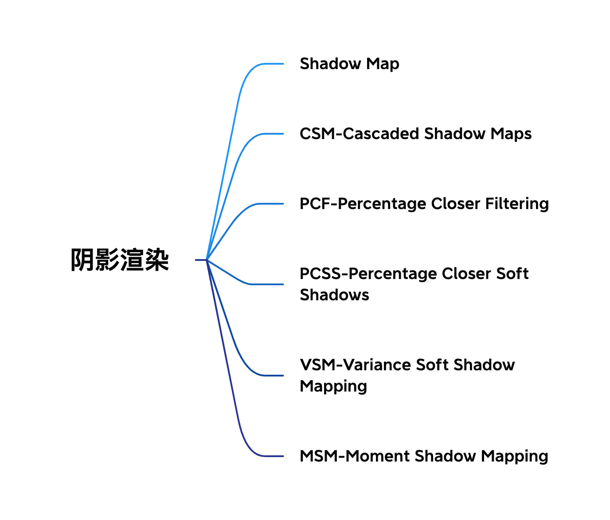
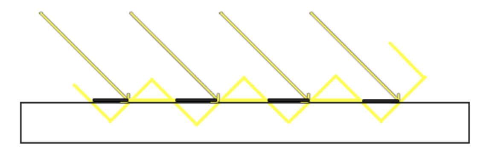
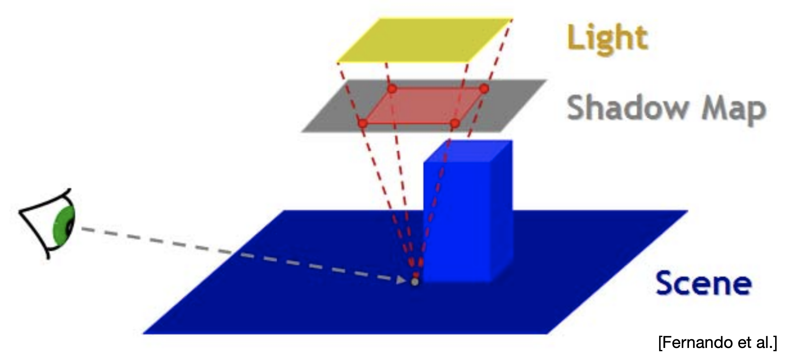
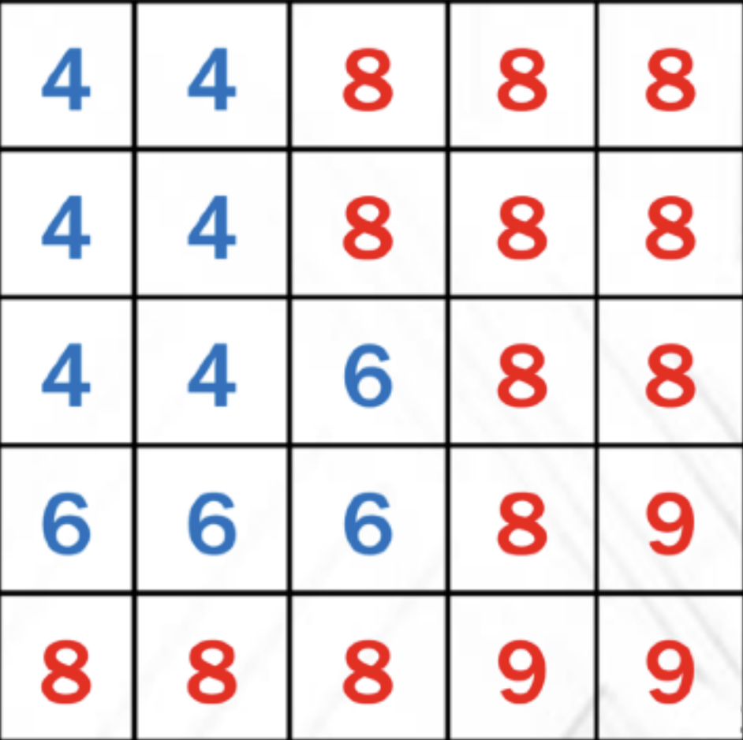
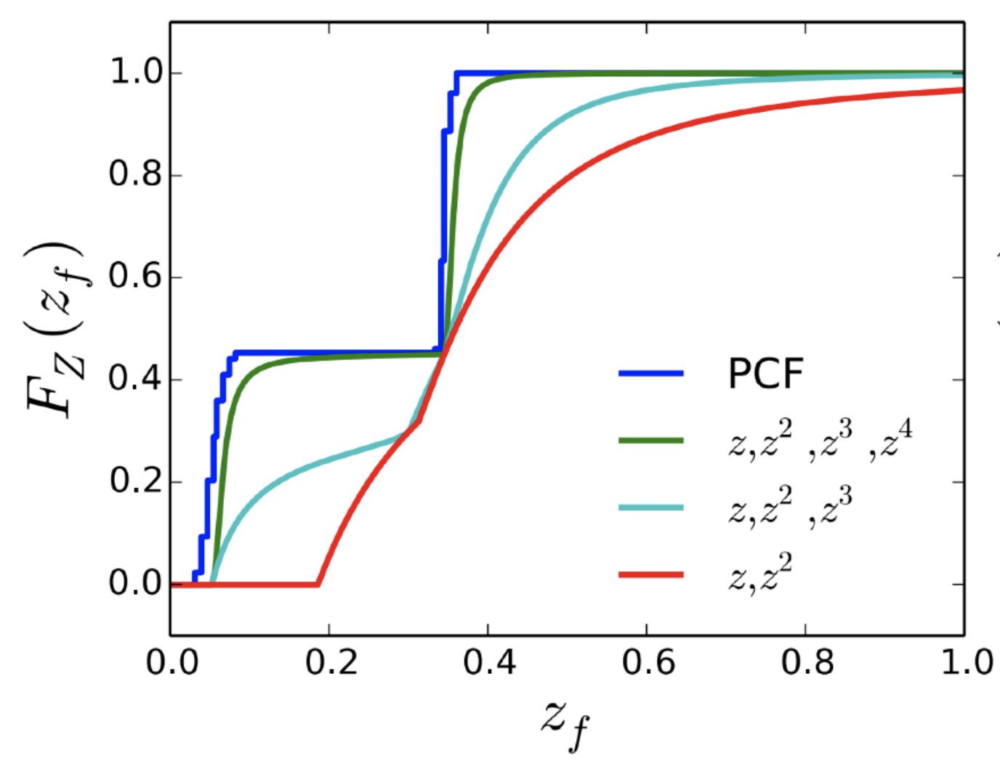

# 实时渲染-阴影渲染总结

首先附上本文的内容结构

## Shadow Map

简单来说，是从光源视角渲染一张深度贴图，记录从光源位置到场景的最小深度。在渲染时根据记录的最小深度判断当前像素是否处在阴影中。

需要注意的是，生成深度贴图之后进行阴影计算时，需要检测一个片段是否处在阴影之中，此时可以在在定点着色器中把定点变换到光空间当中，把光空间的顶点坐标与普通的经过变换的世界空间顶点坐标一起传给片段着色器。在片段着色器中通过光空间的顶点坐标来进行判断该像素是否需要生成阴影。

在进行阴影颜色计算时，由于阴影不会是全黑，因此ambient分量不需要与阴影元素进行相乘。

然而使用这种方法计算出来的阴影由于分辨率的限制会出现阴影失真的问题，形成原因如图所示：

在阴影贴图分辨率比较低的情况下，深度会被认为是以这种阶梯状的形式存在，每一个斜坡代表深度贴图的一个纹理像素，因此在光源方向与接受面的角度非常小的时候，会出现非常大的阴影失真现象。为了改善这种情况，可以在计算阴影时加上一个适当的偏移来保证在一定的深度差范围内，都认为是被阴影遮挡的状态。如此一来则又会产生一个另外的问题，也就是阴影会偏离实际的物体，造成一种悬浮的现象。

## CSM (Cascaded Shadow Maps)

为了解决阴影贴图分辨率带来的问题，CSM使用记录多张深度贴图，按照相机视角场景中的Z值来采样不同分辨率的深度贴图，来解决阴影走样问题。

CSM的具体流程能够分为一下几步：

1. 通过深度Z对相机视锥体进行划分。
2. 计算被划分出来的每个部分的包围盒。
3. 对每个部分生成投影矩阵。
4. 对每个部分生成一张阴影贴图。
5. 对每一个像素选择合适的阴影贴图来进行阴影生成。

CSM需要在一次渲染中计算多张阴影贴图，多张阴影贴图在场景中的交界处也会有明显的过度痕迹。但是过度痕迹可以通过使用在交接处附近对两张纹理进行blend的方式来进行消除。另外，阴影贴图在每一帧重新计算时会有细微差别，也会导致阴影的抖动。

## PCF (Percentage Closer Filtering)

PCF是一种多个不通过滤方式的组合，来使阴影变得更加柔和，使它们更少出现锯齿块和硬边。一个简单的PCF实现就是直接从纹理像素四周对深度贴图采样，然后把结果平均。

## PCSS (Percentage Closer Soft Shadows)

首先从现象导出问题，软阴影在真实光照中，靠近物体的部分更加锐利，远离物体的部分更加模糊，因此需要根据距离来判断filter大小从而渲染出软硬程度不同的阴影。PCSS就着眼于解决如何在不同的距离中选取不同的filter大小的问题。

那么如何求出filter的大小呢，基本思路如下图（取自GAMES202_Lecture_03）所示：

$$ w_{Penumbra} = (d_{Receiver} - d_{Blocker}) \cdot w_{wight} / d_{Blocker} $$

其中根据相似三角形求出的 $w_{Penumbra}$ 即为在该处的filter大小。

而另一个注意点则在于，此处的blocker深度并非在该点处准确的blocker深度，原因在于在阴影贴图中并无法区分出每一个点的深度分别对应于哪一个blocker，因此该深度其实为该blocker的相对平均深度。

如此一来PCSS的算法便可以被分为3个主要步骤：

1. Blocker Search

    在一个特定的范围内获取Blocker平均深度。

2. Penumbra Estimation

    使用获取的Blocker深度来进行filter大小的计算。

3. Percentage Closer Filtering

    使用PCF进行阴影计算。

那么问题来了，需要知道filter的大小就需要先知道Blocker的平均深度，而需要求出Blocker的平均深度也需要现有一个特定的区域范围来进行平均值的计算，那么如何知道最开始的这个这个计算平均深度的范围大小呢，这里有两种方法。

第一种则是从一开始就先取一个固定的区域范围来进行平均深度的计算。

第二种则是在光源的视锥体中，先把阴影贴图放在视锥体的某一个位置，从像素点到光源之间做连线，连线在阴影贴图中截取的区域便是需要做平均值计算的区域。如下图（取自GAMES202_Lecture_03）所示：

如此一来，若阴影贴图越靠近光源，则在阴影贴图上的查询范围则越大，阴影贴图越远离光源，在阴影贴图上的查询范围则越小。通过这种方式来获取最开始的平均深度的查询范围，从而进行平均深度的计算。

PCSS在目前业界的阴影计算中使用范围非常广泛，然而这种方式进行软阴影的计算并非没有缺点。在其算法的第一步与第三部中，需要进行两次区域查询，导致了该算法的开销非常之大，于是便有了下面的改进方法VSSM。

当然，另一种降低开销的方式就是在进行区域查询的时候不查询所有的点而进行随机采样的方式来进行估计，这样能够求得一个近似的均值，但是随机采样的方式必然会导致渲染出来的图像有噪点，而消除噪点的方式则是在渲染完成之后在图像空间做一次去噪处理。而得益于现在去噪算法的发展，去噪的效果变得越来越好，因此这也不失为一种比较不错的方法。

## VSSM (Variance Soft Shadow Mapping)

VSSM的出现主要为了解决PCSS在第一步与第三部开销过大的问题。核心思想就是通过一些技巧来进行近似。

首先是概念上的演化，在PCSS的第三步PCF中，需要计算在filter范围内有多少像素的深度小于该着色点的像素，也就意味着需要知道小于该深度的一个百分比的值。如果将区域内的深度分布近似视为一个正态分布，则只需要知道他们的均值和方差便可以对该分布进行定义，而知道了概率分布的定义之后，便能够直接通过查询的方式获得我们所以需要的这个原本的像素深度加权平均的计算值了。

那么现在问题就被转化成了如何知道该区域内的均值和方差了。

求均值的有两种方式，第一种就是使用mipmap来进行均值计算。但是使用mipmap来进行均值计算在精度方面就会有所限制，于是就有了第二种方式SAT(summed area table)。

SAT是一种使用了前缀和思想的数据结构，简单来说就是在每一个格子内存储的数值由原本的该格子的数值变成了这个格子之前的所有格子的数值之和。这样在查询某一块矩形区域内的数值和时，只需要通过简单的几次加减便可以得到这个区域的值了，而并不用对每一个格子进行查询然后求和。对于前缀和的应用，Leetcode有非常多的题目。

接下来便是方差的求取。方差的求取使用了一个非常基础的期望公式。

$$ Var(X) = E(X^2) - E^2(X) $$

通过这个公式，我们只需要知道X的期望的平方以及X的平方的期望便可以求出方差。对于X平方的期望，我们只需要记录另一张阴影贴图，也就是另一张记录着距离平方的阴影贴图。有了这张新的贴图和原来的贴图这一共两张贴图，便可以轻松求得我们需要的方差值了。

虽然现在出现了两张阴影贴图，但事实上这两张贴图每张只需要一个纹理中的一个通道来进行存储，这也就意味着我们在一次渲染当中，便可以直接把这两张贴图存储到一个纹理当中，在进行查询的时候也只需要进行一张纹理的采样即可。

于是现在便有了深度分布的PDF。那么接下来的任务就是在这个PDF中，求出大于某个值的概率是多少。如果范围仅仅局限与正态分布，这当然可以通过查询数值解的方式进行获得，但如果这不是一个正态分布，而我们又不太需要知道最精确的解，这时候就可以使用到一个叫切比雪夫不等式的东西。

$$ P(X > t) \leq \frac{\sigma^2}{\sigma^2 + (t - \mu)^2} $$

切比雪夫不等式能够知道在PDF中大于t值的最大面积是多少，而我们要求的则是小于t的面积是多少，因此有了这个不等式之后，我们很方便就能知道我们需要求的这个概率的估值是多少了。切比雪夫不等式的应用并不局限于正态分布，应该说，如果是比较简单的单峰PDF我们都可以用这种方式来进行求解。因此它的缺点也显而易见，假如场景中的阴影贴图是一个包含多峰PDF的情况，使用这种方式进行求解的误差便会大大增加，导致最终的渲染效果也有一些显而易见的问题。另外一个问题则是，这个不等式只有在$t>\mu$的情况下才是准确的。

到此为止，PCSS中第三步的开销问题已经被解决成了三个$O(1)$的问题了。接下来便要解决第一步的开销了。也就是在Blocker search中的平均深度的求取问题。

假设现在取到了一个5*5的区域，如图取自（GAMES202_Lecture_04）所示：

首先我们需要求的并不是这个区域内的所有值的平均，而是被遮挡物的深度的平均值，也就是blocker的深度的均值。也就是途中蓝色部分。这里我们把红色部分与蓝色部分的均值分开进行看待。

将蓝色部分$(Z<t)$的均值视作$Z_{occ}$

将红色部分$(Z>t)$的均值视作$Z_{unocc}$

所有值的均值视作$Z_{Avg}$

如此一来，这三个值之间满足一个等式

$$ \frac{N_1}{N}Z_{unocc} + \frac{N_2}{N}Z_{occ} = Z_{Avg} $$

而这里的两个比值$\frac{N_1}{N}$与$\frac{N_2}{N}$，正是可以直接用切比雪夫不等式进行求得。而式子中的$Z_{unocc}$我们可以近似得看作是定值t（假设阴影的接收面是一个平面，深度相等）。因此可以快速求得$Z_{occ}$的值。

这样，在PCSS中第一步的开销也就被解决了。

将上述的两种近似方法结合起来，便是VSSM了。只能说这一系列的假设实在是太巧妙了。

但是VSSM也有着自己的问题，也就是当以上的一系列假设无法适用的情况下，例如阴影贴图的深度分布并不是一个单峰函数，又或者接受面不是一个平面的情况。为了解决这两个问题中的其中一个，也就是概率密度函数不准确的问题，便有了下面的一种方法Moment Shadow Mapping。

## Moment Shadow Mapping

VSSM存储了深度X与X平方的两个贴图，也就是使用了二阶矩来描述概率密度函数。Moment Shadow Mapping意在使用更高阶的矩来去描述概率密度分布函数。

下面是一个结论，前m阶矩能够近似代表一个有m/2个台阶的函数。如下图（取自GAMES202_Lecture_04）所示：

图中绿色的线表示使用4阶矩进行描述的CDF，通常使用4阶矩便已经能够取得非常不错的效果。

好了，对于阴影的渲染算法总结到这里也就差不多了，主要还是受益于GAMES202中对阴影计算的讲解。目前这些算法都还没有自己实现过，理解也十分有限，还是希望后面能够空出一段时间自己把这些算法都试着实现一下，看看在实现过程中的坑都会在哪里。
