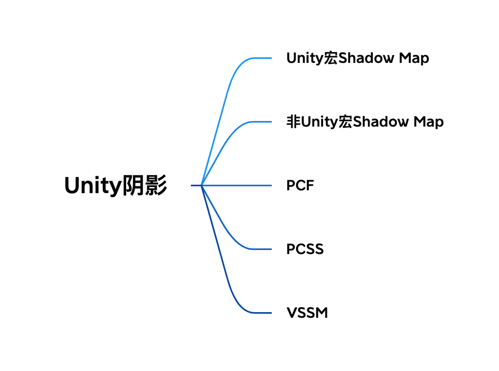
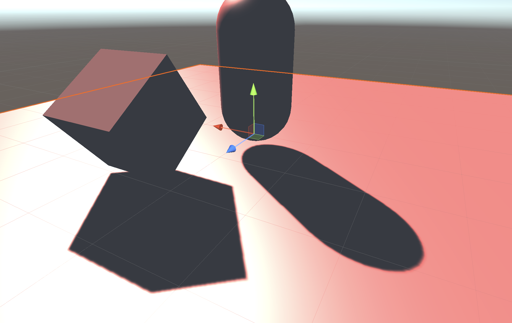
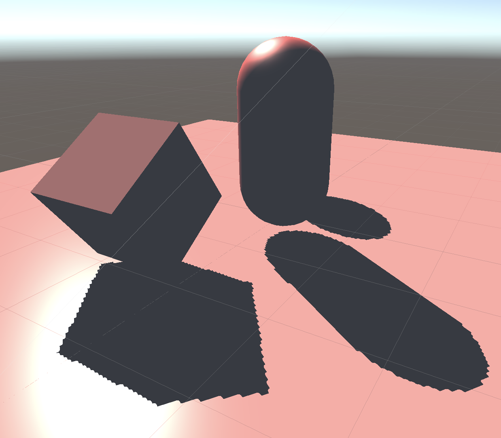
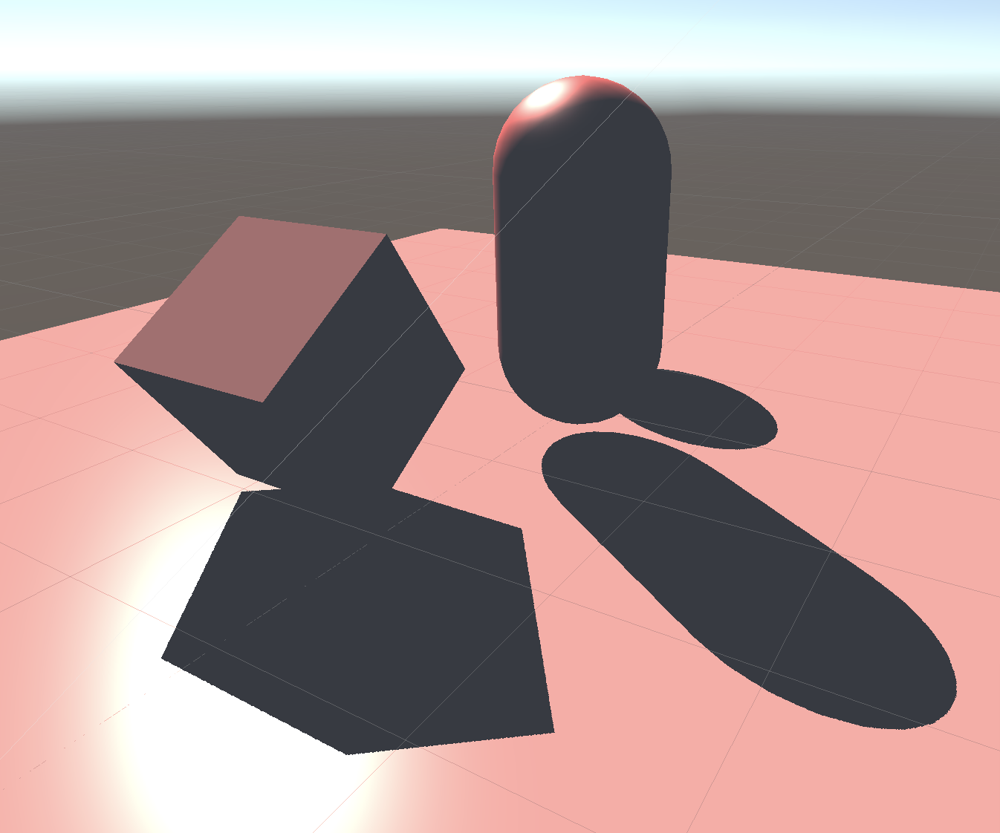
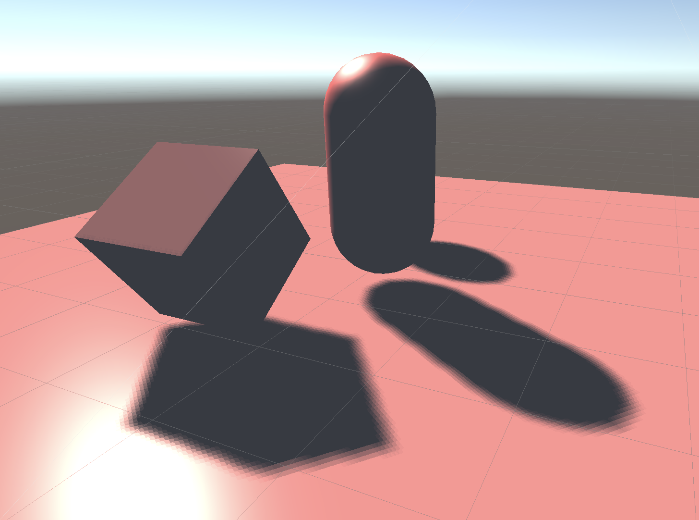
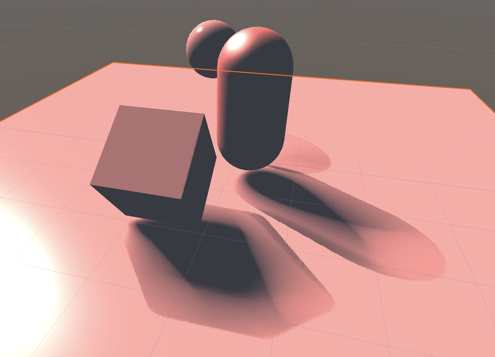
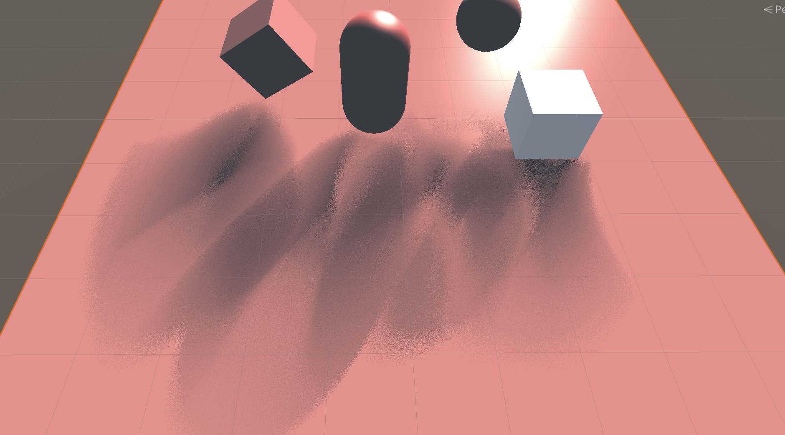
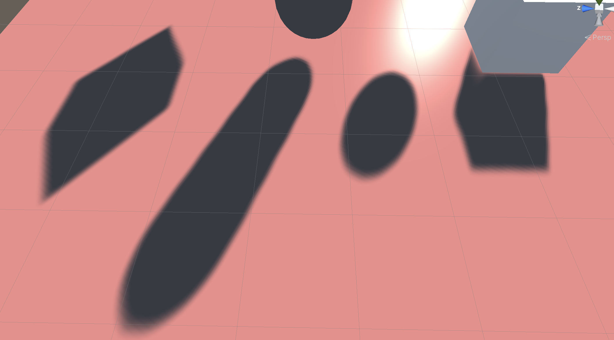
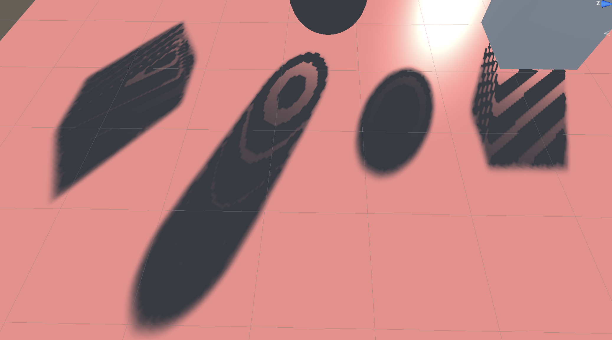

# 实时渲染-阴影渲染实现（Unity）

首先附上本文的内容结构



## 用Unity宏来实现阴影

上次讲了一些阴影的实现原理，经过了这段时间总算使用Unity把这些阴影自己尝试着实现了一下。原理讲起来不难，但是在实现过程中还是踩了不少的坑。下面就让我把这段时间遇到的坑以及整个实现的过程都记录一下。本来是打算用最近在写的一个Vulkan渲染器去实现的，结果由于进度太慢连RHI都还没有封装完，想了想还是先用Unity搞一下好了。果然学习还是要一步一步慢慢来。那废话也不多说了，就开始吧。

既然是Unity的阴影，首先不得不提的就是Unity自带的用来渲染阴影的三个宏，分别是`SHADOW_COORDS`, `TRANSFER_SHADOW`以及`SHADOW_ATTENUATION`。

`SHADOW_COORDS`用于声明一个用于对阴影纹理采样的坐标，使用方法也非常简单，直接写在`v2f`的结构体里面就可以了，例如

```c
struct v2f {
    //其他属性的声明
    ...

    //声明阴影纹理坐标
    SHADOW_COORDS(2)
};
```

`TRANSFER_SHADOW`的实现会根据平台的不同而不同。如果当前平台支持屏幕空间的阴影映射，则会通过调用内置的`ComputeScreenPos`函数来计算`_ShadowCoord`，如果不支持屏幕空间的阴影映射，就会使用传统的阴影映射技术，通过把定点坐标从模型空间变换到光源空间，然后存储到`_ShadowCoord`中。如果我们在`v2f`结构体中使用了`SHADOW_COORDS`，只需要再在顶点着色器中直接使用`TRANSFER_SHADOW`即可

```c
v2f vert(a2v v) {
    v2f o;
    //其他属性值的计算
    ...
    
    //转换纹理坐标
    TRANSFER_SHADOW(o);
    
    return o;
}
```

`SHADOW_ATTENUATION`负责使用`_ShadowCoord`对阴影相关的纹理进行采样得到阴影信息。这句宏也是直接在片元着色器中直接使用即可

```c
fixed4 frag(v2f i) : SV_Target {
    //物体表面光照计算
    ...
    
    //使用内置宏对阴影进行采样
    fixed shadow = SHADOW_ATTENUATION(i);

    return fixed4(ambient + (diffuse + specular) * atten * shadow, 1.0);
}
```

当然，既然是宏，在使用的时候对命名也会有一些要求。为了使这些宏正确工作，需要保证`a2v`结构体中的顶点坐标命名必须为`vertex`， 顶点着色器的输入结构体`a2v`必须命名为`v`，`v2f`中的顶点位置变量必须命名为`pos`。

最后我们只需要在Unity编辑器当中，对想要投射阴影对物体开启`Cast Shadow`选项，对接收阴影的平面开启`Receive Shadows`选项就能渲染出阴影了。效果大概长这样子



但仅仅是这样子的话，我自己好像啥也没有做，于是我又开始折腾，希望能够自己去生成深度贴图，自己去采样，来渲染一个完全是自己写的阴影。

## 抛弃Unity宏来实现阴影

没有了Unity宏的帮助，首先我必须自己生成一张深度贴图。要生成一张深度贴图，大概分为以下几步：

1. 场景中有一个光源，在脚本中获取光源的位置，在对应位置生成一个相机，然后初始化相机。
2. 创建一张新的纹理，来当作相机的渲染目标。
3. 写一个Shader专门用于这次光源相机的渲染，用于生成一张深度贴图。
4. 调用`Camera`的`Render`方法来进行渲染。

这四个步骤就是生成一张深度贴图的流程，我们只需要在Unity调用物体的渲染流程之前把这个过程执行完成即可。这一部分没什么特别需要注意的地方，直接贴关键代码吧。

```cs
//创建相机与纹理
_lightCamera = CreateLightCamera();
_texture = CreateTexture((int) shadowResolution);

//将相机的目标纹理设置为我们刚创建好的纹理
_lightCamera.targetTexture = _texture;

//将光源的位置参数给到相机，是相机与光源在同一位置
var cameraTransform = _lightCamera.transform;
var lightTransform = dirLight.gameObject.transform;

cameraTransform.position = lightTransform.position;
cameraTransform.rotation = lightTransform.rotation;
cameraTransform.localScale = lightTransform.localScale;

//调用深度贴图的着色器来进行一次渲染
_lightCamera.RenderWithShader(depthTextureShader, "");

//将渲染好的深度纹理传递给阴影着色器即可
Shader.SetGlobalTexture("_shadowMapTexture", _texture);
//将光源相机的VP矩阵传递给着色器，用于后面将物体从世界坐标转换到光源相机的裁剪坐标当中，来生成shadowCoord
Matrix4x4 projectionMatrix = GL.GetGPUProjectionMatrix(_lightCamera.projectionMatrix, false);
Matrix4x4 viewMatrix = _lightCamera.worldToCameraMatrix;
Shader.SetGlobalMatrix(WorldToShadowID, projectionMatrix * viewMatrix);
```

接着是渲染深度贴图的着色器的代码，需要注意的是这边为了使深度的精度更高，在存取深度值的时候把深度值编码为`RGBA`4通道进行存储，从而获得更高的精度。

```c
v2f vert(a2v v)
{
    v2f o;
    o.position = UnityObjectToClipPos(v.vertex);
    return o;
}

fixed4 frag(v2f i) : SV_Target
{
    float depth = i.position.z / i.position.w;

    //根据不同平台对深度值归一化
    #if defined(SHADER_TARGET_GLSL)
        depth = depth * 0.5 + 0.5;
    #elif defined(UNITY_REVERSED_Z)
        depth = 1 - depth;
    #endif
    
    return EncodeFloatRGBA(depth);
}
```

到这一步我们的深度贴图就已经处理完成了，现在应该拿着这张阴影贴图去生成阴影了。此时我们无需再关心脚本这边代码的编写，只需要专注与阴影着色器的编写就可以了。

在阴影着色器的`v2f`结构体中，这次需要手动声明`shadowCoord`属性，来存储对阴影采样的纹理坐标。而`shadowCoord`的计算也十分简单，这里就直接贴代码吧

```c
v2f vert(a2v v)
{
    v2f o;
    //其他属性的计算
    ...

    //阴影采样坐标的计算
    //1. 从物体坐标系转到世界坐标系
    o.worldPos = mul(unity_ObjectToWorld, v.vertex);
    //2. 从世界坐标系转到光源相机坐标系。_worldToShadow就是刚传进来的光源相机的VP矩阵的乘积
    o.shadowCoord = mul(_worldToShadow, o.worldPos);
}
```               

现在有了在光源空间的`shadowCoord`，但是需要注意的是，这里计算出来的`shadowCoord`依然是在光源相机裁剪坐标系下面的值，也就是说它的范围现在是`[-1, 1]`，如果要对纹理进行采样，我们还得把它转换成范围值为`[0, 1]`的uv坐标。

```c
float2 uv = i.shadowCoord.xy / i.shadowCoord.w;
uv = uv * 0.5 + 0.5;
```

uv的计算完成之后，还需要通过`shadowCoord`的`z`值来计算现在从接收平面的像素点到光源的真正深度。

```c
float depth = i.shadowCoord.z / i.shadowCoord.w;
#if defined(SHADER_TARGET_GLSL)
    depth = depth * 0.5 + 0.5;    
#elif defined(UNITY_REVERSED_Z)
    depth = 1 - depth;      
#endif
```

现在使用刚刚计算的uv坐标对深度贴图进行采样，再与真正的深度值进行对比，就可以计算得到阴影值了。再在判断过程中加上阴影的偏移值，就更舒服了。

```c
float hardShadow(float depth, float2 uv)
{
    float4 orignDepth = tex2D(_shadowMapTexture, uv);
    float sampleDepth = DecodeFloatRGBA(orignDepth);
    return (sampleDepth + _shadowBias) < depth ? _shadowStrength : 1;
}
```

这里分别展示一张阴影贴图在高分辨率与低分辨率下的阴影效果图





这里可以看到在低分辨率下的阴影有非常大的锯齿，效果非常不好。但是让我惊讶的是我在低分辨率的阴影贴图下各种调整光照的方向，试了好久都没有试出阴影失真的现象，这点令我非常不解。期间我尝试改变了深度贴图的存储精度，光照方向等等参数都没有试出来阴影失真应该产生的条纹。如果看到这篇文章的大佬有知道的话请一定要在下面留言告诉我。

于是乎，为了解决锯齿的问题，搬出了众所周知的PCF。

## PCF

这里我所使用的pcf非常简单，就是直接根据filterSize的大小进行一个均值滤波。由于原理非常简单就直接上代码吧。

```c
float pcf(float depth, float2 uv, int filterSize)
{
    float shadow = 0.0;
    int halfSize = max(0, (filterSize - 1) / 2);
    for(int i = -halfSize; i <= halfSize; ++i)
    {
        for(int j = -halfSize; j < halfSize; ++j)
        {
            //这里进行采样时需要将uv乘上_shadowMapTexture_TexelSize来进行像素点偏移的采样
            float4 orignDepth = tex2D(_shadowMapTexture, uv + float2(i, j) * _shadowMapTexture_TexelSize.xy);
            float sampleDepth = DecodeFloatRGBA(orignDepth);
            shadow += (sampleDepth + _shadowBias) < depth ? _shadowStrength : 1;
        }
    }
    return shadow / (filterSize * filterSize);
}
```

再来看看PCF之后的使用低分辨率深度贴图的阴影效果，可以看到锯齿的现象已经明显改善了许多，甚至有了软阴影的感觉。图中的效果我所取得filterSize的大小为5。



既然已经到了这一步，那就索性也把软阴影也实现一下吧。

## PCSS

PCSS的实现就有些许复杂起来了。根据上一篇文章所讲，PCSS的计算过程一共分为三个部分，这边我就重新复制粘贴一下。

1. Blocker Search

    在一个特定的范围内获取Blocker平均深度。

2. Penumbra Estimation

    使用获取的Blocker深度来进行filter大小的计算。

3. Percentage Closer Filtering

    使用PCF进行阴影计算。

那首先就来实现第一步`Blocker Search`。

在做这一步之前，首先我们要假设把阴影贴图放在光源与阴影接收面中间的某个位置，没错就是那张图所描述的。


同时，也需要假设这个光源是一个面光源。这样就得到了一个光源Size的值。有了这两个值之后我们可以利用图中这两个相似三角形的比来计算出我们需要在shadow map中搜索blocker的范围是多少，然后计算出他们的平均深度即可。

但是这里我们并不像上面的PCF那样去搜索每一个点，而是根据柏松分布来随机采样一定的搜索点，通过这种方式来降低计算量。给出的代码如下

```c
float findBlocker(float depth, float2 uv)
{
    int blockerSearchNumSamples = _Samples;
    float lightSizeUV = _LightSize / _LightFrustumWidth;
    float searchRadius = lightSizeUV * (depth - _NearPlane) / depth;
    float blockerDepthSum = 0.0;
    int numBlockers = 0;
    for(int i = 0; i < blockerSearchNumSamples; i++)
    {
        float4 orignDepth = tex2D(_shadowMapTexture, uv + poissonDisk[i] *  searchRadius);
        float sampleDepth = DecodeFloatRGBA(orignDepth);

        if(sampleDepth < depth)
        {
            blockerDepthSum += sampleDepth;
            numBlockers++;
        }
    }
    if(numBlockers == 0)
    {
        return -1.0;
    }
    return blockerDepthSum / numBlockers;
}
```

接下来第二步是计算在深度贴图中使用PCF采样的filter的大小。这里也要分为两步进行计算。主要也是通过两个相似三角形进行相比来得出。

```c
//计算该点投影在平面上影子大小（软阴影的大小）
float penumbraRatio = (depth - avgBlockerDepth) / avgBlockerDepth * _LightSize;
//通过影子大小反过来计算在ShadowMap上的filter大小
float filterSize = penumbraRatio * _NearPlane / depth;
```

最后一步就是对每一个区域做不同filter大小的PCF采样了。这里同样使用柏松分布进行随机采点，而不是像上面那样对每一个像素点都进行采样。

```c
float pcfSample(float depth, float2 uv, float filterSize)
{
    float shadow = 0.0;
    int numSamples = _Samples;

    for(int i  = 0; i < numSamples; ++i)
    {
        float4 orignDepth = tex2D(_shadowMapTexture, uv + poissonDisk[i] *  filterSize);
        float sampleDepth = DecodeFloatRGBA(orignDepth);
        shadow += (sampleDepth + _shadowBias) < depth ? _shadowStrength : 1;
    }

    for(int i  = 0; i < numSamples; ++i)
    {
        float4 orignDepth = tex2D(_shadowMapTexture, uv - poissonDisk[i] * filterSize);
        float sampleDepth = DecodeFloatRGBA(orignDepth);
        shadow += (sampleDepth + _shadowBias) < depth ? _shadowStrength : 1;
    }
    return shadow / (2.0 * numSamples);
}
```

这样子就能实现一个基本的PCSS软阴影的效果了。调了调参数，大概就是这个效果



调一调参数也可以调出更夸张的阴影效果（但是总感觉不管怎么调也没有别人做的好看，之后再想办法优化优化吧）



最后就是为了解决PCSS计算量问题而出现的VSSM了。

## VSSM

VSSM实现的关键在于在阴影贴图中需要同时存储深度以及深度的平方，这就需要我们对计算深度贴图的着色器进行更改。改法也很简单，直接把这两个值输出就好了。不过我在这边是直接存了深度的4次方。

```c
fixed4 frag(v2f i) : SV_Target
{
    float depth = i.position.z / i.position.w;
    
    #if defined(SHADER_TARGET_GLSL)
        depth = depth * 0.5 + 0.5;
    #elif defined(UNITY_REVERSED_Z)
        depth = 1 - depth;
    #endif
    
    float depth2 = depth * depth;
    float depth3 = depth2 * depth;
    float depth4 = depth3 * depth;

    return float4(depth, depth2, depth3, depth4);
}
```

然后由于在计算方差的时候，需要用到的是一个区域内深度的期望以及深度的平方的期望，也就是

$$ Var(X) = E(X^2) - E^2(X) $$

显然直接用这张深度贴图丢进着色器里面是获取不到这个期望值的。这里就先把这张计算好的深度贴图丢进`Compute Shader`里头做一次均值滤波。在脚本当中稍稍加几行调用调用计算着色器的代码。

```cs
//循环次数为调用compute shader的次数，每一次调用都在compute shader里面执行一次3*3的均值滤波
for (int i = 0; i < 7; ++i)
{
    blurShader.SetTexture(0, "Read", _texture);
    blurShader.SetTexture(0, "Result", _blurTexture);
    blurShader.Dispatch(0, _texture.width / 8, _texture.height / 8, 1);
    
    Swap(ref _texture, ref _blurTexture);
}
```

也顺便学习了一下Unity的Compute Shader的写法

```c
void CSMain (uint3 id : SV_DispatchThreadID)
{
    float4 pixel = float4(0, 0, 0, 0);
    for(int i = -1; i <= 1; ++i)
    {
        for(int j = -1; j <= 1; ++j)
        {
            uint2 index = id.xy;
            index.x += i;
            index.y += j;
            pixel += Read[index.xy] / 9;
        }
    }
    pixel.a = 1;
    Result[id.xy] = pixel;
}
```

接着把做完处理的贴图传给阴影着色器，在计算方差时候就只需要采样对应像素的深度和深度平方的值，直接做差就可以了。后面的步骤就只要按着公式走就可以了。

```c
//核心代码就这一些
float vssm(float depth, float2 uv)
{
    float4 depthTexture = tex2D(_shadowMapTexture, uv);

    float d1 = depthTexture.r;
    float d2 = depthTexture.g;
    float variance = clamp(d2 - d1 * d1, 0, 1);
    float delta = depth - d1;

    if((d1 + _shadowBias) < depth)
    {
        float p1 = variance;
        float p2 = variance + delta * delta;
        float p = p1 / p2;
        return p;
    } else
    {
        return 1.0;
    }
}
```

这是VSSM最终实现的效果



需要注意的是，进行VSSM深度贴图计算的时候，需要把生成纹理的格式更改为`RGFLOAT`从而获得更高的精度，否则在计算深度平方的时候会因为精度问题而导致误差，这个误差在进行方差计算的时候会有非常大的影响。这个问题困扰了非常久，当时也猜到了是精度问题，但是没想到最后的解决方式是修改了纹理格式。

这里也放上以上错误的效果示范



以上就是在实现各种阴影的过程中陆陆续续踩的一些坑了，花了不少时间（虽然中间大部分时间都跑去狩猎了）。代码我会上传到github，有兴趣的朋友可以自取，当然，如果发现其中有一些算法或者实现上的错误能够告诉我的话也是再好不过，毕竟本人Unity萌新以及图形学萌新。