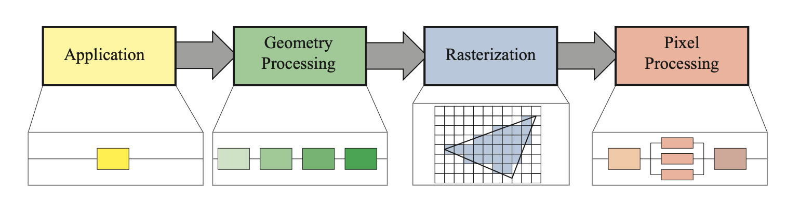

# 2. 图形渲染管线

## 2.1 架构

图形渲染管线一般分为应用阶段(Application)，几何处理阶段(Geometry Processing)，光栅化阶段(Rasterization)，像素处理阶段(Pixel Processing)。

渲染管线中每个阶段的并行是使用管线能够提升执行效率的主要原因。

管线中的每一个阶段通常他本身也是一条管线，其中包含数个子阶段。我们将这里的功能阶段(Function Stage)与实现结构(Structure of Implementation)区分开来。一个功能阶段包含一个特定的任务但是不规定这个任务的执行方式。一个实现结构可能把多个功能阶段通过可编程内核包含在多个单元内或者把一个十分耗时的功能阶段划分为几个硬件单元。

可知渲染管线的结构只是规定了每一个阶段需要执行的任务，并没有规定使用什么样的方式去执行这个任务，根据特定的实现可以对上述阶段再进行不同划分，只要保证每一阶段的任务能够顺利完成即可，可见渲染管线的实现也拥有非常大的自由度。

渲染效率一般使用帧率(FPS)或是频率(Hz)来进行表示。帧率可以特指某一帧的帧率也可以表示为平均帧率，在硬件上通常使用频率(Hz)来进行表示。

应用阶段通常由上层应用进行驱动，运行在CPU上。通常会包含并行的多线程处理结构，通过CPU的多核结构来进行效率优化。根据应用的不同，一些应用也会包含物理碰撞，全局加速算法，动画，物理模拟等其他任务，并在CPU上去执行这些任务。

几何处理阶段通常会处理仿射变换，投影变换等多种几何操作，这个阶段会计算出哪些东西将会在哪里以什么养的方式进行绘制。几何处理单元通常在GPU中被执行。

光栅化阶段会通过三角形的三个顶点来找到三角形所包含的像素，并将这些传递给下个阶段。

最后的像素处理阶段会执行一个程序来将像素进行着色，并且会执行深度测试来确定该像素是否该被现实出来。这个阶段同样会执行一些逐像素操作，例如将新的颜色与该像素旧的颜色进行混合。光栅化与像素处理阶段完全在GPU中进行执行。

## 2.2 应用阶段

应用阶段的任务一般执行在CPU中，但是依据不同的实现，应用阶段也会影响后面几个阶段在GPU中的执行效率，例如某些能够减少在GPU渲染的三角形的算法或设置。

GPU中也能够通过计算着色器(Compute Shader)来完成某些需要在CPU中完成的任务，计算着色器会把GPU视作一个高并行通用计算处理器。

应用阶段的最后阶段会将需要被渲染的几何数据传递到几何处理阶段，包括点，线，三角面等。而这些几何最终将会在显示设备中被绘制出来。

应用阶段由于是基于软件实现，因此无法被分为多个子阶段。同时在此阶段通常会并行执行在多个CPU核中，在CPU中这样的设计被称为超标量架构(SuperScalar Construction)，能够同时执行多个处理任务。

碰撞检测通常会在应用阶段进行实现，因为碰撞检测通常需要在检测到碰撞之后将响应返回给碰撞的物体。应用阶段也通常被用来处理不同的输入源。根据不同的输入来采取不同的动作。另外，加速算法，例如某些特定的面剔除算法也会在这个阶段被实现，这些是后面三个阶段都无法处理的。

## 2.3 几何处理阶段
